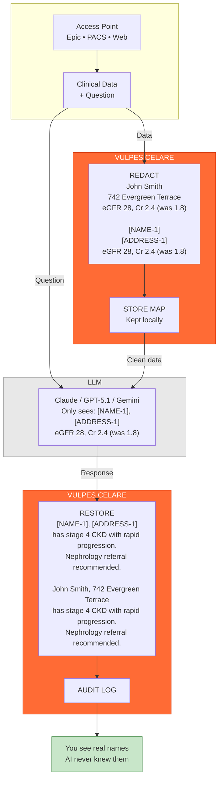

# VULPES CELARE


 

An open-source PHI redaction engine for clinical text, images, and DICOM data. The project combines TypeScript orchestration with Rust-accelerated compute paths to provide a fully inspectable, auditable de-identification pipeline suitable for healthcare research and air-gapped deployments.

| Metric | Score | Notes |
|:------:|:-----:|:------|
| Sensitivity | 99%+ | Synthetic corpus, see `docs/BENCHMARKS.md` |
| Specificity | 96%+ | Synthetic corpus, see `docs/BENCHMARKS.md` |
| Speed | <10ms | Typical clinical notes, Rust-accelerated |
| Coverage | 18/18+ | HIPAA Safe Harbor + extended (28 filters, 20+ PHI types) |

**Current Status**: The engine has comprehensive test coverage against synthetic data (99%+ sensitivity). Clinical validation against the i2b2 2014 corpus is pending. We recommend pilot testing in controlled environments and research workflows before critical care deployment. Institution-specific validation should be completed for production clinical use.

## Architecture Overview



PHI never crosses the network boundary. The LLM receives only tokenized placeholders while the mapping remains local.

## Design Goals

**Healthcare-Specific Detection** — The filter set targets clinical documentation patterns rather than general-purpose NER. Coverage includes all 18 HIPAA Safe Harbor identifiers plus extended types (NPI, DEA, VIN, etc.) across 28 specialized filters.

**Performance** — Rust acceleration handles compute-intensive operations. Typical clinical notes process in under 10ms. Streaming support enables real-time dictation workflows. See `docs/BENCHMARKS.md` for methodology and measurements.

**Air-Gapped Operation** — No cloud dependencies. All processing runs locally, suitable for high-security and offline environments.

**Auditability** — No black-box ML for PHI detection decisions. The codebase is fully inspectable TypeScript + Rust with deterministic rule-based detection. Trust bundles provide tamper-evident provenance for compliance requirements.

**Graceful Degradation** — All Rust accelerators have TypeScript fallbacks. The engine runs correctly (with reduced performance) if native bindings fail to load.

## Installation

```bash
npm install vulpes-celare
```

## Basic Usage

```ts
import { VulpesCelare, anonymizeDicomBuffer } from "vulpes-celare";

// Text redaction
const safeText = await VulpesCelare.redact(clinicalNote);

// Image redaction (faces + OCR text)
const redactedImage = await VulpesCelare.redactImage(imageBuffer);

// DICOM anonymization
const cleanDicom = await anonymizeDicomBuffer(dicomData);
```

## Applications

### LLM Integration

The primary use case is enabling LLM integration in clinical workflows without exposing PHI. Redact before sending to external models, restore identifiers in the response. See `examples/integrations/LLM-INTEGRATIONS.md` for integration examples with OpenAI, Anthropic, and AWS Bedrock APIs.

### Research De-identification

De-identify datasets while preserving temporal relationships and clinical context. The Policy DSL allows customization of redaction rules to meet IRB requirements. See `examples/policy-dsl/POLICY-DSL.md`.

### Real-Time Dictation

Streaming redaction for live clinical documentation. Rust streaming kernels handle incremental detection with sub-10ms latency per chunk. See `examples/streaming/STREAMING-API.md`.

### Medical Imaging

DICOM anonymization with metadata scrubbing and safe re-encoding. Image redaction removes detected faces and OCR text regions. See `docs/IMAGE-DICOM.md`.

## Documentation

- Overview: `docs/README.md`
- Architecture: `docs/ARCHITECTURE.md`
- Images + DICOM: `docs/IMAGE-DICOM.md`
- CLI Reference: `docs/CLI.md`
- Trust Bundles: `docs/TRUST-BUNDLE.md`
- Streaming API: `examples/streaming/STREAMING-API.md`
- Policy DSL: `examples/policy-dsl/POLICY-DSL.md`
- LLM Integrations: `examples/integrations/LLM-INTEGRATIONS.md`

## Native Rust Core

The Rust addon (`src/rust/`) handles compute-intensive tasks:

- PaddleOCR ONNX inference (text detection + recognition)
- UltraFace ONNX inference (face detection)
- Crypto/provenance helpers (SHA-256, HMAC-SHA256, Merkle root) for trust bundles and DICOM hashing

TypeScript orchestrates policies and workflows while Rust owns ONNX inference and vision post-processing.

### Text Accelerators

Eleven production-ready Rust accelerators handle text processing hotspots: phonetic matching, tokenization, span overlap/application, name scanning, post-filter pruning, fuzzy matching, OCR chaos detection, multi-identifier scanning, and streaming kernels. All accelerators have TypeScript fallbacks for cross-platform compatibility. Set `VULPES_*_ACCEL=0` environment variables to disable specific accelerators. See `docs/RUST-NATIVE.md` for details.

### ONNX Runtime (Windows)

Windows builds include a bundled ONNX Runtime CPU DLL at `native/onnxruntime.dll`, pinned to the version required by the Rust `ort` crate (1.22.x).

To use a different runtime (CUDA, DirectML, etc.), set before importing:

```bat
set VULPES_ORT_PATH=C:\path\to\onnxruntime.dll
REM or
set ORT_DYLIB_PATH=C:\path\to\onnxruntime.dll
```

### ONNX Runtime (macOS/Linux)

Native packaging is currently Windows-first. The engine runs in JS-only mode on other platforms. Building the native core on macOS/Linux requires a pinned ORT shared library at:

- macOS: `native/libonnxruntime.dylib`
- Linux: `native/libonnxruntime.so`

Fetch the pinned CPU build with `npm run native:ort:download`, or override with `VULPES_ORT_PATH`/`ORT_DYLIB_PATH`.

## CLI

```bash
npm run install-global

vulpes              # Interactive menu
vulpes chat         # LLM chat with auto-redaction
vulpes --help       # All options
```

## Building from Source

```bash
npm run native:install
npm run native:build
npm run build
npm test
```

Run strict gating (non-zero exit on threshold failures):

```bash
npm run test:strict
```

Verify native addon loads correctly: `node scripts/test_simple.js`

## License

Interim license (pending Apache 2.0). Research and non-commercial use permitted. See `LICENSE` for details.

## Contributing

Contributions welcome. Particularly valuable: i2b2 validation testing, pilot deployment feedback, and security audits.
