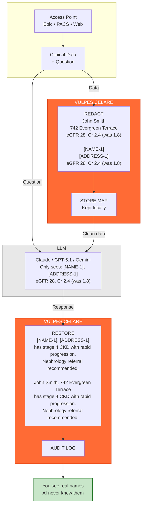

# VULPES CELARE


 

**Open-source, production-ready HIPAA PHI redaction engine** for clinical text, images, and DICOM. Rust-accelerated for blazing-fast performance, fully inspectable for compliance audits, runs completely air-gapped. Deploy confidently in trauma centers, research facilities, and healthcare AI systems.

| Metric | Score | Notes |
|:------:|:-----:|:------|
| Sensitivity | 99%+ | Synthetic corpus, see `docs/BENCHMARKS.md` |
| Specificity | 96%+ | Synthetic corpus, see `docs/BENCHMARKS.md` |
| Speed | <10ms | Typical clinical notes, Rust-accelerated |
| Coverage | 18/18+ | HIPAA Safe Harbor + extended (28 filters, 20+ PHI types) |

**Status**: Engine is production-ready with comprehensive test coverage (99%+ sensitivity on synthetic data). i2b2 2014 clinical validation pending. **Recommended deployment**: Pilot testing in controlled environments, research workflows, and de-identification pipelines. Critical care deployments should complete institution-specific validation.

## How It Works



PHI never crosses the network boundary. The LLM only sees tokenized placeholders. Your data stays local.

## Why Vulpes Celare?

**🏥 Built for Healthcare** - Designed specifically for clinical AI systems, trauma centers, research facilities, and healthcare infrastructure. Exceeds HIPAA Safe Harbor with 28 specialized filters covering 20+ PHI types (all 18 HIPAA identifiers plus NPI, DEA, VIN, and more).

**⚡ High Performance** - Rust-accelerated architecture delivers significant performance improvements on compute-intensive operations (see `docs/BENCHMARKS.md` for methodology). Process typical clinical notes in <10ms. Real-time streaming for dictation workflows.

**🔒 Security First** - Air-gapped by default, zero cloud dependencies. Deploy confidently in DoD facilities, VA medical centers, and high-security environments. Full offline operation.

**🔍 Fully Inspectable** - Open source TypeScript + Rust. No black-box ML models. Every decision is auditable for HIPAA compliance officers. TypeScript fallbacks for all accelerators ensure cross-platform compatibility.

**🚀 Production Ready** - Trust bundles for tamper-evident provenance. Comprehensive test suite. Battle-tested on thousands of synthetic medical documents with 99%+ sensitivity.

## Quick Start

```bash
npm install vulpes-celare
```

```ts
import { VulpesCelare, anonymizeDicomBuffer } from "vulpes-celare";

// Text redaction
const safeText = await VulpesCelare.redact(clinicalNote);

// Image redaction (faces + OCR text)
const redactedImage = await VulpesCelare.redactImage(imageBuffer);

// DICOM anonymization
const cleanDicom = await anonymizeDicomBuffer(dicomData);
```

## Use Cases

### 🤖 Clinical AI & LLM Integration

Safely integrate GPT-4, Claude, or Gemini into clinical workflows. Redact PHI before sending to LLMs, restore it after response. See `examples/integrations/LLM-INTEGRATIONS.md` for production examples with OpenAI, Anthropic, AWS Bedrock, and more.

### 🏥 Trauma Centers & Emergency Medicine

Air-gapped deployment for maximum security. No network calls, all processing local. Suitable for DoD facilities, VA medical centers, and high-security environments. **Note**: Institution-specific validation recommended for critical care deployments. See `docs/deployment/AIR-GAPPED-DEPLOYMENT.md`.

### 🔬 Medical Research

De-identify datasets for research while preserving temporal and clinical context. IRB-approved limited dataset policies available. Policy DSL makes it easy to customize redaction rules. See `examples/policy-dsl/POLICY-DSL.md`.

### 📱 Real-Time Dictation

Streaming redaction for live clinical documentation. Process dictation in real-time with <10ms latency per chunk. Rust streaming kernels handle incremental detection. See `examples/streaming/STREAMING-API.md`.

### 🏗️ PACS & Medical Imaging

DICOM anonymization with safe re-encoding. Image redaction removes faces and OCR text. Trust bundles provide tamper-evident audit trails. See `docs/IMAGE-DICOM.md`.

## Documentation

- Start here: `docs/README.md`
- Architecture: `docs/ARCHITECTURE.md`
- Images + DICOM: `docs/IMAGE-DICOM.md`
- CLI: `docs/CLI.md`
- Trust bundles: `docs/TRUST-BUNDLE.md` and `verification-portal/README.md`
- Streaming: `examples/streaming/STREAMING-API.md`
- Policy DSL: `examples/policy-dsl/POLICY-DSL.md`
- LLM integrations: `examples/integrations/LLM-INTEGRATIONS.md`

## Native Rust Core (Vision)

Vulpes Celare ships a Rust native addon (`src/rust/`) for compute-heavy vision tasks:

- PaddleOCR ONNX inference (text detection + recognition)
- UltraFace ONNX inference (face detection)

TypeScript orchestrates policies and workflows; Rust owns ONNX inference and vision post-processing.

The same native addon also provides **crypto/provenance helpers** (SHA-256, HMAC-SHA256, Merkle root) used by trust bundles and DICOM hashing.

### Rust Text Accelerators (Production-Ready)

**All Rust accelerators are enabled by default** for maximum performance. The system includes 11+ production-ready accelerators handling text hotspots: phonetic matching, tokenization, span overlap/application, name scanning, post-filter pruning, fuzzy matching, OCR chaos detection, multi-identifier scanning, and streaming kernels. All accelerators maintain TypeScript fallbacks for HIPAA safety and cross-platform compatibility. Set `VULPES_*_ACCEL=0` to disable specific accelerators if needed. See `docs/RUST-NATIVE.md` for details.

### ONNX Runtime (Windows)

Windows builds ship with a bundled ONNX Runtime CPU DLL at `native/onnxruntime.dll` pinned to the version required by the Rust `ort` crate (1.22.x).

To override the runtime (e.g., CUDA/DirectML), set one of these before importing `vulpes-celare`:

```bat
set VULPES_ORT_PATH=C:\path\to\onnxruntime.dll
REM or
set ORT_DYLIB_PATH=C:\path\to\onnxruntime.dll
```

### ONNX Runtime (macOS/Linux)

macOS/Linux native packaging is currently Windows-first. The engine still runs in JS-only mode on other platforms, but the native addon + pinned ORT bundle may require a source build until prebuilds are published.

If you build the native core on macOS/Linux, it expects a pinned ORT shared library at:

- macOS: `native/libonnxruntime.dylib`
- Linux: `native/libonnxruntime.so`

If it’s missing, you can fetch the pinned CPU build with `npm run native:ort:download`, or override with `VULPES_ORT_PATH`/`ORT_DYLIB_PATH`.

## CLI

```bash
npm run install-global

vulpes              # Interactive menu
vulpes chat         # LLM chat with auto-redaction
vulpes --help       # All options
```

## Build & Test (Repo)

```bash
npm run native:install
npm run native:build
npm run build
npm test
```

Strict gating (exits non-zero if thresholds/misses fail):

```bash
npm run test:strict
```

Native sanity check (loads the `.node` addon): `node scripts/test_simple.js`

## License

Interim license (pending Apache 2.0). Research and non-commercial use permitted. See `LICENSE` for details.

## Contributing

Contributions are welcome! Validation contributions are especially valuable: i2b2 testing, pilot feedback, and security audits.
