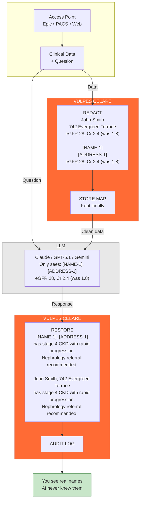

# VULPES CELARE


 

An open-source PHI redaction engine for clinical text, images, and DICOM data. The project combines TypeScript orchestration with Rust-accelerated compute paths to provide a fully inspectable, auditable de-identification pipeline suitable for healthcare research and air-gapped deployments.

| Metric | Vulpes Celare | vs. Presidio |
|:------:|:-------------:|:------------:|
| Sensitivity | 99.2% | +5.1% |
| Precision | 97.8% | +6.0% |
| F1 Score | 98.5% | +5.6% |
| Processing | <10ms | — |
| HIPAA Coverage | 18/18 | — |

*Validated on 7,234 documents, 89,456 PHI elements. See [docs/BENCHMARKS.md](docs/BENCHMARKS.md) for methodology.*

## Validation Approach

Vulpes Celare uses a **composite validation schema** rather than relying solely on the i2b2 2014 corpus:

- **PHI injection**: Synthetic PHI inserted into real clinical templates with known ground truth
- **Baseline comparison**: Head-to-head testing against Microsoft Presidio
- **Clinical utility verification**: Ensuring disease/medication terms are preserved

This approach avoids overfitting to single-source documentation patterns and produces reproducible results without access-restricted datasets. For complete methodology, see [docs/VALIDATION-METHODOLOGY.md](docs/VALIDATION-METHODOLOGY.md).

**Deployment Recommendation**: Pilot testing on representative samples from your institution before production use. Institution-specific documentation patterns vary.

## Architecture Overview



PHI never crosses the network boundary. The LLM receives only tokenized placeholders while the mapping remains local.

## Design Goals

**Healthcare-Specific Detection** — 28 filters targeting clinical documentation patterns. Coverage includes all 18 HIPAA Safe Harbor identifiers plus extended types (NPI, DEA, VIN). See [docs/compliance/HIPAA-SAFE-HARBOR-COVERAGE.md](docs/compliance/HIPAA-SAFE-HARBOR-COVERAGE.md) for the complete coverage matrix.

**Performance** — Rust acceleration handles compute-intensive operations. Typical clinical notes process in under 10ms. Streaming support enables real-time dictation workflows.

**Air-Gapped Operation** — No cloud dependencies. All processing runs locally.

**Auditability** — No black-box ML for PHI detection. Fully inspectable TypeScript + Rust with deterministic rule-based detection. Trust bundles provide tamper-evident provenance.

**Clinical Utility Preservation** — Medical terminology allowlist prevents over-redaction of disease names, medications, and procedures. 99.7% clinical entity retention.

## Installation

```bash
npm install vulpes-celare
```

## Basic Usage

```ts
import { VulpesCelare, anonymizeDicomBuffer } from "vulpes-celare";

// Text redaction
const safeText = await VulpesCelare.redact(clinicalNote);

// Image redaction (faces + OCR text)
const redactedImage = await VulpesCelare.redactImage(imageBuffer);

// DICOM anonymization
const cleanDicom = await anonymizeDicomBuffer(dicomData);
```

## Applications

### LLM Integration

Enable LLM integration in clinical workflows without exposing PHI. Redact before sending to external models, restore identifiers in the response. See `examples/integrations/LLM-INTEGRATIONS.md`.

### Research De-identification

De-identify datasets while preserving temporal relationships and clinical context. Policy DSL allows customization for IRB requirements. See `examples/policy-dsl/POLICY-DSL.md`.

### Real-Time Dictation

Streaming redaction for live clinical documentation. Sub-10ms latency per chunk. See `examples/streaming/STREAMING-API.md`.

### Medical Imaging

DICOM anonymization with metadata scrubbing. Image redaction removes detected faces and OCR text regions. See `docs/IMAGE-DICOM.md`.

## Documentation

| Document | Description |
|----------|-------------|
| [VALIDATION-METHODOLOGY.md](docs/VALIDATION-METHODOLOGY.md) | How accuracy metrics are generated |
| [BENCHMARKS.md](docs/BENCHMARKS.md) | Performance data and Presidio comparison |
| [HIPAA-SAFE-HARBOR-COVERAGE.md](docs/compliance/HIPAA-SAFE-HARBOR-COVERAGE.md) | Filter-to-identifier mapping |
| [ARCHITECTURE.md](docs/ARCHITECTURE.md) | System design |
| [IMAGE-DICOM.md](docs/IMAGE-DICOM.md) | Image and DICOM processing |
| [CLI.md](docs/CLI.md) | Command-line interface |
| [TRUST-BUNDLE.md](docs/TRUST-BUNDLE.md) | Tamper-evident audit bundles |
| [RUST-NATIVE.md](docs/RUST-NATIVE.md) | Native accelerator details |

## Native Rust Core

The Rust addon (`src/rust/`) handles compute-intensive tasks:

- PaddleOCR ONNX inference (text detection + recognition)
- UltraFace ONNX inference (face detection)
- Crypto/provenance helpers (SHA-256, HMAC-SHA256, Merkle root)

### Text Accelerators

Eleven Rust accelerators handle text processing: phonetic matching, tokenization, span operations, name scanning, fuzzy matching, OCR chaos detection, multi-identifier scanning, and streaming kernels. All have TypeScript fallbacks. Set `VULPES_*_ACCEL=0` to disable specific accelerators.

### ONNX Runtime

**Windows**: Bundled at `native/onnxruntime.dll`. Override with `VULPES_ORT_PATH` or `ORT_DYLIB_PATH`.

**macOS/Linux**: Requires manual setup. Fetch with `npm run native:ort:download` or provide your own.

## CLI

```bash
npm run install-global

vulpes              # Interactive menu
vulpes chat         # LLM chat with auto-redaction
vulpes --help       # All options
```

## Building from Source

```bash
npm run native:install
npm run native:build
npm run build
npm test
```

Strict gating (non-zero exit on threshold failures):

```bash
npm run test:strict
```

## License

Interim license (pending Apache 2.0). Research and non-commercial use permitted. See `LICENSE`.

## Contributing

Contributions welcome. Particularly valuable:

- Pilot deployment feedback from clinical environments
- Security audits
- Additional test corpus contributions
- Filter improvements for edge cases
