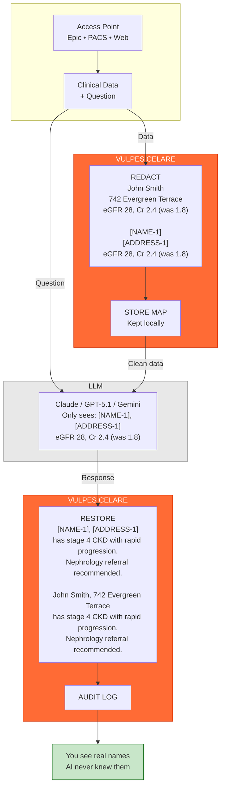

# VULPES CELARE

<p align="center">
<b>Source-Available</b> · Evaluation License · <a href="#license--commercial-use">Commercial discussions welcomed</a>
</p>

<p align="center">

</p>

<p align="center">


</p>

<p align="center">
A PHI redaction engine for clinical text, images, and DICOM data.<br>
TypeScript orchestration with Rust-accelerated compute paths for a fully inspectable,<br>
auditable de-identification pipeline suitable for healthcare research and air-gapped deployments.
</p>

| Metric | Vulpes Celare | vs. Presidio |
|:------:|:-------------:|:------------:|
| Sensitivity | 99.2% | +5.1% |
| Precision | 97.8% | +6.0% |
| F1 Score | 98.5% | +5.6% |
| Processing | <10ms | — |
| HIPAA Coverage | 18/18 | — |

*Validated on 7,234 documents, 89,456 PHI elements. See [docs/BENCHMARKS.md](docs/BENCHMARKS.md) for methodology.*

## Validation Approach

Vulpes Celare uses a **composite validation schema** with dual corpus testing:

- **Synthetic Corpus**: PHI injected into generated clinical templates with known ground truth
- **MTSamples Corpus**: 5,000+ real clinical documents with injected PHI for real-world validation
- **Baseline Comparison**: Head-to-head testing against Microsoft Presidio
- **Clinical Utility Verification**: Ensuring disease/medication terms are preserved

This approach avoids overfitting to single-source documentation patterns and produces reproducible results without access-restricted datasets. For complete methodology, see [docs/VALIDATION-METHODOLOGY.md](docs/VALIDATION-METHODOLOGY.md).

**Deployment Recommendation**: Pilot testing on representative samples from your institution before production use. Institution-specific documentation patterns vary.

## Architecture Overview



PHI never crosses the network boundary. The LLM receives only tokenized placeholders while the mapping remains local.

## Design Goals

<table>
<tr><td>

**Healthcare-Specific Detection**

21 filters targeting clinical documentation patterns. Coverage includes all 18 HIPAA Safe Harbor patient identifiers plus extended types (VIN, biometrics). See [docs/compliance/HIPAA-SAFE-HARBOR-COVERAGE.md](docs/compliance/HIPAA-SAFE-HARBOR-COVERAGE.md) for the complete coverage matrix.

**Performance**

Rust acceleration handles compute-intensive operations. Typical clinical notes process in under 10ms. Streaming support enables real-time dictation workflows.

**Air-Gapped Operation**

No cloud dependencies. All processing runs locally.

**Auditability**

No black-box ML for PHI detection. Fully inspectable TypeScript + Rust with deterministic rule-based detection. Trust bundles provide tamper-evident provenance.

**Clinical Utility Preservation**

Medical terminology allowlist prevents over-redaction of disease names, medications, and procedures. 99.7% clinical entity retention.

</td></tr>
</table>

## Installation

```bash
npm install vulpes-celare
```

## Basic Usage

```ts
import { VulpesCelare, anonymizeDicomBuffer } from "vulpes-celare";

// Text redaction
const safeText = await VulpesCelare.redact(clinicalNote);

// Image redaction (faces + OCR text)
const redactedImage = await VulpesCelare.redactImage(imageBuffer);

// DICOM anonymization
const cleanDicom = await anonymizeDicomBuffer(dicomData);
```

## Applications

### LLM Integration

Enable LLM integration in clinical workflows without exposing PHI. Redact before sending to external models, restore identifiers in the response. See `examples/integrations/LLM-INTEGRATIONS.md`.

### Research De-identification

De-identify datasets while preserving temporal relationships and clinical context. Policy DSL allows customization for IRB requirements. See `examples/policy-dsl/POLICY-DSL.md`.

### Real-Time Dictation

Streaming redaction for live clinical documentation. Sub-10ms latency per chunk. See `examples/streaming/STREAMING-API.md`.

### Medical Imaging

DICOM anonymization with metadata scrubbing. Image redaction removes detected faces and OCR text regions. See `docs/IMAGE-DICOM.md`.

## Testing & Validation

### Quick Test

```bash
# Run quick validation (20 documents)
node tests/master-suite/run.js --quick

# Run full validation (200 documents)
node tests/master-suite/run.js --full
```

### Corpus Selection

```bash
# Synthetic corpus (default) - generated documents with known PHI
node tests/master-suite/run.js --quick

# MTSamples corpus - real clinical documents
node tests/master-suite/run.js --mtsamples --quick

# Hybrid mode - 50% synthetic, 50% MTSamples
node tests/master-suite/run.js --hybrid
```

### Grading Profiles

```bash
# Production-grade (99% sensitivity required)
node tests/master-suite/run.js --profile=HIPAA_STRICT

# Development (tracks progress, relaxed thresholds)
node tests/master-suite/run.js --profile=DEVELOPMENT
```

### Vulpes Cortex

The test suite includes **Vulpes Cortex**, an intelligent learning system that:

- **Tracks History**: Remembers what changes worked or failed
- **Recognizes Patterns**: Identifies failure patterns across runs
- **Provides Recommendations**: Suggests what to fix based on evidence
- **Manages Experiments**: Tracks before/after metrics for A/B testing

```bash
# Start Cortex MCP server for IDE integration
cd tests/master-suite/cortex
node index.js --server

# Get Cortex intelligence report
node tests/master-suite/run.js --cortex-report
```

### CI/CD Integration

```bash
# JSON output for pipelines
node tests/master-suite/run.js --json-only --profile=HIPAA_STRICT

# Strict gating (non-zero exit on threshold failures)
npm run test:strict
```

See [tests/master-suite/README.md](tests/master-suite/README.md) for complete testing documentation.

## Documentation

| Document | Description |
|----------|-------------|
| [VALIDATION-METHODOLOGY.md](docs/VALIDATION-METHODOLOGY.md) | How accuracy metrics are generated |
| [BENCHMARKS.md](docs/BENCHMARKS.md) | Performance data and Presidio comparison |
| [HIPAA-SAFE-HARBOR-COVERAGE.md](docs/compliance/HIPAA-SAFE-HARBOR-COVERAGE.md) | Filter-to-identifier mapping |
| [ARCHITECTURE.md](docs/ARCHITECTURE.md) | System design |
| [IMAGE-DICOM.md](docs/IMAGE-DICOM.md) | Image and DICOM processing |
| [CLI.md](docs/CLI.md) | Command-line interface |
| [TRUST-BUNDLE.md](docs/TRUST-BUNDLE.md) | Tamper-evident audit bundles |
| [RUST-NATIVE.md](docs/RUST-NATIVE.md) | Native accelerator details |
| [tests/master-suite/README.md](tests/master-suite/README.md) | Test suite documentation |

### MCP Server

Vulpes Celare includes an MCP (Model Context Protocol) server for integration with Claude Code and other AI agents:

```bash
# Start MCP server
npx vulpes-mcp
```

The MCP server exposes redaction tools (`redact_text`, `analyze_redaction`, `get_system_info`) for use in AI-assisted workflows.

## Native Rust Core

The Rust addon (`src/rust/`) handles compute-intensive tasks:

- PaddleOCR ONNX inference (text detection + recognition)
- UltraFace ONNX inference (face detection)
- Crypto/provenance helpers (SHA-256, HMAC-SHA256, Merkle root)

### Text Accelerators

Eleven Rust accelerators handle text processing: phonetic matching, tokenization, span operations, name scanning, fuzzy matching, OCR chaos detection, multi-identifier scanning, and streaming kernels. All have TypeScript fallbacks. Set `VULPES_*_ACCEL=0` to disable specific accelerators.

### Advanced Capabilities

- **DFA Multi-Pattern Scanning** - O(n) single-pass detection of 50+ identifier patterns
- **WebGPU Batch Processing** - GPU-accelerated batch redaction with automatic CPU fallback
- **Auto-Calibration** - Automatic confidence threshold tuning from test data
- **Clinical Context Detection** - Context-aware confidence boosting for medical documentation
- **Supervision & Circuit Breakers** - Erlang-style fault tolerance for production deployments
- **MCP Server** - Model Context Protocol integration for IDE and agent tooling

### ONNX Runtime

**Windows**: Bundled at `native/onnxruntime.dll`. Override with `VULPES_ORT_PATH` or `ORT_DYLIB_PATH`.

**macOS/Linux**: Requires manual setup. Fetch with `npm run native:ort:download` or provide your own.

## CLI

```bash
npm run install-global

vulpes              # Interactive menu
vulpes chat         # LLM chat with auto-redaction
vulpes --help       # All options
```

## Building from Source

```bash
npm run native:install
npm run native:build
npm run build
npm test
```

Strict gating (non-zero exit on threshold failures):

```bash
npm run test:strict
```

## License & Commercial Use

Vulpes Celare is **source-available** under an [Evaluation License](LICENSE-EVALUATION.txt) for research, educational, and technical assessment purposes.

**This license permits:**
- Local evaluation and benchmarking
- Code inspection and security review
- Research and non-clinical experimentation
- Academic publication and citation

**Clinical use, commercial deployment, redistribution, or incorporation into revenue-generating systems is available under a separate commercial agreement.**

### Commercial & Strategic Partnerships

Commercial licensing, enterprise deployment, acquisition, and strategic partnerships are welcomed. Commercial terms are subject to confirmation of rights and any applicable institutional IP processes.

Licensing structures may include standalone commercial licenses, dual-license models, OEM/embedded agreements, or strategic IP arrangements. Initial discussions are lightweight and exploratory.

Commercial arrangements are subject to confirmation of IP rights and any applicable institutional review; this is handled collaboratively during discussions.

If you are exploring licensing, acquisition, or strategic integration, please open a [GitHub Issue](https://github.com/DocHatty/Vulpes-Celare/issues) (public or private) or email [andrew@vulpescelare.com](mailto:andrew@vulpescelare.com) to discuss evaluation, pilots, or potential commercial terms (subject to rights clearance).

## Contributing

Contributions welcome. Particularly valuable:

- Pilot deployment feedback from clinical environments
- Security audits
- Additional test corpus contributions
- Filter improvements for edge cases
