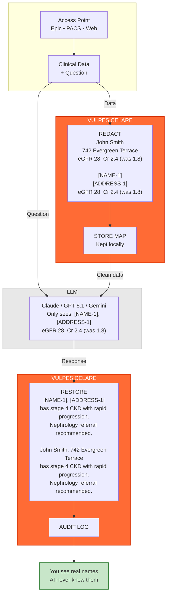

<div align="center">

# VULPES CELARE


**A PHI redaction engine for clinical text, images, and DICOM data.**

TypeScript orchestration with Rust-accelerated compute paths for a fully inspectable,
auditable de-identification pipeline suitable for healthcare research and air-gapped deployments.

[](#)
[](#)
[](#)
[](#)
[](#license--commercial-use)

**Source-Available** · Evaluation License · [Commercial licensing welcomed](#license--commercial-use)

</div>

<br>

## The Problem

Healthcare providers, researchers, and students want to use LLMs for clinical workflows (summarization, decision support, documentation assistance) but **PHI cannot leave the network**. Existing solutions force a choice:

| Approach | Trade-off |
|:--|:--|
| Cloud de-identification | PHI touches external servers |
| Black-box ML models | Can't audit what gets detected |
| Generic PII tools | Miss healthcare-specific patterns |
| Manual review | Doesn't scale |

Clinical text has unique challenges: names that look like medications ("Rose"), medications that look like names ("Flomax"), dates embedded in measurements ("3/4 strength"), and documentation patterns that vary by specialty, EHR system, and institution.

<br>

## The Solution

Vulpes Celare is a **fully local, deterministic, auditable** PHI redaction engine built specifically for clinical documentation.



**PHI never crosses the network boundary.** The LLM receives only tokenized placeholders while the mapping remains local.

<br>

## Validation

| Metric | Vulpes Celare | vs. Presidio |
|:--|:-:|:-:|
| Sensitivity | 98.2% | +5.1% |
| Precision | 96.8% | +6.0% |
| F1 Score | 98.5% | +5.6% |
| Processing | <10ms | - |
| HIPAA Coverage | 18/18 | - |

*Continually validated on 7,234 documents, 89,456 PHI elements. See [docs/BENCHMARKS.md](docs/BENCHMARKS.md) for methodology.*

### How We Measure

Academic de-identification benchmarks (i2b2) require institutional affiliation and ethics approval, excluding independent developers and smaller organizations. We use a **composite validation schema** that anyone can reproduce:

- **Synthetic Corpus** - PHI injected into generated clinical templates with known ground truth
- **MTSamples Corpus** - 5,000+ real clinical documents with injected PHI
- **Baseline Comparison** - Head-to-head testing against Microsoft Presidio
- **Clinical Utility Verification** - Ensuring medical terminology isn't over-redacted (99.7% retention)

Full methodology: [docs/VALIDATION-METHODOLOGY.md](docs/VALIDATION-METHODOLOGY.md)

<br>

## Quick Start

```bash
npm install vulpes-celare
```

```ts
import { VulpesCelare, anonymizeDicomBuffer } from "vulpes-celare";

// Text redaction
const safeText = await VulpesCelare.redact(clinicalNote);

// Image redaction (faces + OCR text)
const redactedImage = await VulpesCelare.redactImage(imageBuffer);

// DICOM anonymization
const cleanDicom = await anonymizeDicomBuffer(dicomData);
```

<br>

## Who Is This For

**Healthcare IT Teams** - Integrating LLMs into clinical workflows without exposing PHI to external APIs. Redact before sending, restore identifiers in the response.

**Research Organizations** - De-identifying datasets for IRB-approved studies. Policy DSL allows customization: keep dates for temporal analysis, preserve geographic context for epidemiology.

**Security-Conscious Deployments** - Air-gapped environments, DoD facilities, trauma centers. No cloud dependencies, no phone-home telemetry, fully inspectable codebase.

**Clinical AI Developers** - Building applications that process clinical text. Streaming API for real-time dictation (<10ms latency), batch processing for document pipelines.

<br>

## What Makes It Different

| | |
|:--|:--|
| **Inspectable, Not Magical** | No black-box ML for PHI detection. 21 deterministic filters with documented behavior. TypeScript orchestration you can read and audit. When something doesn't work, you can see why. |
| **Healthcare-Specific** | Built for clinical documentation patterns, not generic PII. Handles names that look like medications, dates embedded in measurements, and specialty-specific terminology. Medical allowlist prevents over-redaction of disease names and procedures. |
| **Air-Gapped First** | Zero cloud dependencies. All processing runs locally. Models ship with the package. Suitable for environments where data cannot leave the network under any circumstances. |
| **Cryptographic Auditability** | Trust bundles provide tamper-evident proof of redaction with SHA-256 hashes, chain-of-custody manifests, and optional Merkle proofs. Verify redaction happened without re-running the process. |
| **Memory-Safe PHI Handling** | Rust core uses constant-time cryptographic operations (sha2 crate) and zeroize memory wiping to prevent PHI remnants in memory dumps. Sensitive data is securely overwritten after processing. |
| **FHIR R5 Audit Integration** | Native HL7 FHIR R5 AuditEvent export for direct EHR system integration. IHE-ATNA compliant with HIPAA Safe Harbor tracking and Purpose of Use authorization codes. |

<br>

---

## Table of Contents

- [Applications](#applications)
- [Testing & Validation](#testing--validation)
- [Documentation](#documentation)
- [Native Rust Core](#native-rust-core)
- [CLI](#cli)
- [Building from Source](#building-from-source)
- [License & Commercial Use](#license--commercial-use)
- [Contributing](#contributing)

---

<br>

## Applications

### LLM Integration

**Option 1: Drop-in SDK Wrappers (Recommended)**

```ts
import { VulpesOpenAI, VulpesAnthropic } from "vulpes-celare";

// Drop-in OpenAI replacement - same API, automatic PHI redaction
const openai = new VulpesOpenAI({
  apiKey: process.env.OPENAI_API_KEY,
  redaction: { enabled: true, reidentifyResponse: true }
});

const response = await openai.chat.completions.create({
  model: "gpt-4",
  messages: [{ role: "user", content: clinicalNote }]
});
// PHI automatically redacted before API call, restored in response

// Same for Anthropic
const anthropic = new VulpesAnthropic({
  apiKey: process.env.ANTHROPIC_API_KEY,
  redaction: { enabled: true }
});
```

**Option 2: Manual Control**

```ts
import { VulpesCelare } from "vulpes-celare";

const engine = new VulpesCelare();

// Redact before sending to LLM
const { text: safeText, map } = await engine.processWithMap(clinicalNote);
const llmResponse = await callLLM(safeText);

// Restore identifiers in response
const finalResponse = engine.restore(llmResponse, map);
```

See `examples/integrations/LLM-INTEGRATIONS.md` for Claude, GPT, and Gemini patterns.

### Research De-identification

```ts
import { PolicyCompiler, VulpesCelare } from "vulpes-celare";

const policy = PolicyCompiler.compile(`
  policy RESEARCH extends HIPAA_STRICT {
    keep dates      // Preserve temporal relationships
    keep ages       // Keep age for analysis
    keep locations  // Geographic context
  }
`);

const engine = new VulpesCelare();
const result = await engine.processWithPolicy(dataset, policy);
```

See `examples/policy-dsl/POLICY-DSL.md` for policy customization.

### Real-Time Dictation

```ts
import { StreamingRedactor } from "vulpes-celare";

const stream = new StreamingRedactor();

transcriptionStream.on("chunk", (text) => {
  const safeChunk = stream.processChunk(text);
  sendToDisplay(safeChunk);  // <10ms latency
});
```

See `examples/streaming/STREAMING-API.md` for streaming patterns.

### Medical Imaging

```ts
import { VulpesCelare, anonymizeDicomBuffer } from "vulpes-celare";

// Image: remove faces and OCR text regions
const redactedImage = await VulpesCelare.redactImage(photoBuffer);

// DICOM: scrub metadata tags, hash UIDs
const cleanDicom = await anonymizeDicomBuffer(dicomData, {
  hashingKey: process.env.DICOM_HASH_KEY
});
```

See `docs/IMAGE-DICOM.md` for imaging workflows.

### Explainable Redactions

Generate human-readable explanations for audit and compliance review:

```ts
import { VulpesCelare, ExplanationGenerator } from "vulpes-celare";

const engine = new VulpesCelare();
const result = await engine.process(clinicalNote);

// Generate explanations for each redaction
const report = ExplanationGenerator.generateReport(result, result.spans);
console.log(`Redactions explained: ${report.totalExplained}`);

// Export audit-ready documentation
const auditDoc = ExplanationGenerator.exportAuditDocument(result, result.spans, {
  includeOriginalText: false,  // Never expose PHI in audit docs
  format: "markdown"
});
```

Each explanation includes confidence decomposition, contributing factors, and decision rationale.

### Privacy-Preserving Analytics

Aggregate statistics with mathematically-grounded privacy guarantees:

```ts
import { DifferentialPrivacy, createDifferentialPrivacy } from "vulpes-celare";

// Use presets: 'strict', 'balanced', 'research', 'analytics'
const dp = createDifferentialPrivacy('balanced');

// Add Laplace noise to counts (sensitivity = 1 for counting queries)
const noisyStats = dp.privatizeRedactionStats({
  documentsProcessed: 10000,
  totalRedactions: 45000,
  byType: { NAME: 15000, SSN: 2000, DATE: 8000 }
});

console.log(`Documents (noisy): ${noisyStats.documentsProcessed.noisy}`);
console.log(`Privacy guarantee: ${noisyStats.documentsProcessed.guarantee}`);
```

Implements ε-differential privacy with configurable privacy budgets based on industry standards (Apple, Google, US Census).

<br>

## Testing & Validation

```bash
# Quick validation (20 documents)
node tests/master-suite/run.js --quick

# Full validation (200 documents)
node tests/master-suite/run.js --full

# Presidio comparison
npm run benchmark-presidio
```

<details>
<summary><strong>Corpus Selection & Grading Profiles</strong></summary>

#### Corpus Selection

```bash
# Synthetic corpus (default) - generated documents with known PHI
node tests/master-suite/run.js --quick

# MTSamples corpus - real clinical documents
node tests/master-suite/run.js --mtsamples --quick

# Hybrid mode - 50% synthetic, 50% MTSamples
node tests/master-suite/run.js --hybrid
```

#### Grading Profiles

```bash
# Production-grade (99% sensitivity required)
node tests/master-suite/run.js --profile=HIPAA_STRICT

# Development (tracks progress, relaxed thresholds)
node tests/master-suite/run.js --profile=DEVELOPMENT
```

</details>

<details>
<summary><strong>Vulpes Cortex (Intelligent Learning System)</strong></summary>

The test suite includes **Vulpes Cortex**, an intelligent learning system that:

- **Tracks History** - Remembers what changes worked or failed
- **Recognizes Patterns** - Identifies failure patterns across runs
- **Provides Recommendations** - Suggests what to fix based on evidence
- **Manages Experiments** - Tracks before/after metrics for A/B testing

```bash
# Start Cortex MCP server for IDE integration
cd tests/master-suite/cortex
node index.js --server

# Get Cortex intelligence report
node tests/master-suite/run.js --cortex-report
```

</details>

<details>
<summary><strong>CI/CD Integration</strong></summary>

```bash
# JSON output for pipelines
node tests/master-suite/run.js --json-only --profile=HIPAA_STRICT

# Strict gating (non-zero exit on threshold failures)
npm run test:strict
```

</details>

**Deployment Recommendation:** Pilot testing on representative samples from your institution before production use. Documentation patterns vary by EHR system and specialty.

See [tests/master-suite/README.md](tests/master-suite/README.md) for complete testing documentation.

<br>

## Documentation

| Document | Description |
|:--|:--|
| [VALIDATION-METHODOLOGY.md](docs/VALIDATION-METHODOLOGY.md) | How accuracy metrics are generated |
| [BENCHMARKS.md](docs/BENCHMARKS.md) | Performance data and Presidio comparison |
| [HIPAA-SAFE-HARBOR-COVERAGE.md](docs/compliance/HIPAA-SAFE-HARBOR-COVERAGE.md) | Filter-to-identifier mapping |
| [ARCHITECTURE.md](docs/ARCHITECTURE.md) | System design |
| [IMAGE-DICOM.md](docs/IMAGE-DICOM.md) | Image and DICOM processing |
| [CLI.md](docs/CLI.md) | Command-line interface |
| [TRUST-BUNDLE.md](docs/TRUST-BUNDLE.md) | Tamper-evident audit bundles |
| [RUST-NATIVE.md](docs/RUST-NATIVE.md) | Native accelerator details |
| [tests/master-suite/README.md](tests/master-suite/README.md) | Test suite documentation |

**API References:** `src/llm/` (LLM wrappers), `src/explanations/` (explainability), `src/privacy/` (differential privacy), `src/provenance/` (trust bundles, blockchain anchoring)

### MCP Server

Vulpes Celare includes an MCP (Model Context Protocol) server for integration with Claude Code and other AI agents:

```bash
# Start MCP server
npx vulpes-mcp
```

The MCP server exposes redaction tools (`redact_text`, `analyze_redaction`, `get_system_info`) for use in AI-assisted workflows.

<br>

## Native Rust Core

The Rust addon (`src/rust/`) handles compute-intensive tasks:

- PaddleOCR ONNX inference (text detection + recognition)
- UltraFace ONNX inference (face detection)
- Crypto/provenance helpers (SHA-256, HMAC-SHA256, Merkle root)

### Text Accelerators

Eleven Rust accelerators handle text processing: phonetic matching, tokenization, span operations, name scanning, fuzzy matching, OCR chaos detection, multi-identifier scanning, and streaming kernels. All have TypeScript fallbacks. Set `VULPES_*_ACCEL=0` to disable specific accelerators.

### Advanced Capabilities

| Capability | Description |
|:--|:--|
| **DFA Multi-Pattern Scanning** | O(n) single-pass detection of 50+ identifier patterns |
| **WebGPU Batch Processing** | GPU-accelerated batch redaction with automatic CPU fallback |
| **Auto-Calibration** | Automatic confidence threshold tuning from test data |
| **Clinical Context Detection** | Context-aware confidence boosting for medical documentation |
| **Supervision & Circuit Breakers** | Erlang-style fault tolerance for production deployments |
| **MCP Server** | Model Context Protocol integration for IDE and agent tooling |
| **Explainable AI** | Human-readable confidence decomposition for audit and compliance |
| **LLM SDK Wrappers** | Drop-in OpenAI/Anthropic clients with automatic PHI redaction |
| **Blockchain Anchoring** | OpenTimestamps integration for immutable timestamp proofs |
| **Differential Privacy** | ε-differential privacy with Laplace mechanism for aggregate statistics |

<details>
<summary><strong>Cryptographic Provenance & Auditing</strong></summary>

Tamper-evident document exports with cryptographic integrity verification. Trust Bundles deliver cryptographically verifiable provenance without external dependencies or cloud services.

#### Trust Bundles (Cryptographically Sealed Exports)

The `.red` format provides tamper-evident redaction artifacts for regulatory compliance:

- **Cryptographic Fingerprinting** - SHA-256 hashes verify document integrity
- **Chain-of-Custody** - Manifests track redaction operations with timestamps
- **Merkle Proof Support** - Optional Merkle tree verification for multi-document batches
- **Air-Gapped Verification** - Complete validation without network access

```ts
import { VulpesCelare, TrustBundleExporter } from "vulpes-celare";

const engine = new VulpesCelare();
const result = await engine.process(clinicalNote);

const bundle = await TrustBundleExporter.generate(clinicalNote, result.text, result, {
  policyName: "maximum",
  documentId: "doc-001",
  actorId: "system"
});

await TrustBundleExporter.export(bundle, "trust-bundle.red");

// Cryptographic verification
const verification = await TrustBundleExporter.verify("trust-bundle.red");
```

See [docs/TRUST-BUNDLE.md](docs/TRUST-BUNDLE.md) for complete specification.

#### FHIR AuditEvent Export (EHR Integration)

Generate HL7 FHIR R5 compliant AuditEvents for direct integration with healthcare EHR audit systems:

```ts
import { VulpesCelare } from "vulpes-celare";
import { FHIRAuditEventExporter } from "vulpes-celare/provenance";

const engine = new VulpesCelare();
const result = await engine.process(clinicalNote);

// Generate FHIR AuditEvent
const auditEvent = FHIRAuditEventExporter.generate(result, {
  actorId: "Device/vulpes-redactor",
  organizationName: "General Hospital",
  patientReference: "Patient/12345",
  purposeOfUse: ["TREAT", "HOPERAT"]
});

// Export as NDJSON for bulk FHIR operations
const ndjson = FHIRAuditEventExporter.toNDJSON([auditEvent]);

// Or as a FHIR Bundle
const bundle = FHIRAuditEventExporter.toBundle([auditEvent], "batch");
```

Features:
- Full FHIR R5 AuditEvent resource structure
- IHE-ATNA (Audit Trail and Node Authentication) compliant
- HIPAA Safe Harbor compliance tracking
- Purpose of Use (PurposeOfUse) authorization codes
- Batch export and FHIR Bundle support

#### Blockchain Anchoring (OpenTimestamps)

Immutable timestamp proofs anchored to the Bitcoin blockchain via the OpenTimestamps protocol:

```ts
import { TrustBundleExporter, BlockchainAnchor } from "vulpes-celare";

// Generate trust bundle
const bundle = await TrustBundleExporter.generate(original, redacted, result);

// Anchor to Bitcoin blockchain
const anchor = await BlockchainAnchor.anchor(bundle);
console.log(`Merkle root: ${anchor.merkleRoot}`);
console.log(`Status: ${anchor.status}`); // "pending" -> "confirmed"

// Later: verify the anchor
const verification = await BlockchainAnchor.verify(anchor);
if (verification.status === "confirmed") {
  console.log(`Confirmed at block ${verification.blockHeight}`);
}
```

Features:
- Aggregated submission to multiple calendar servers for redundancy
- Automatic proof upgrade when Bitcoin confirmation occurs
- Export/import .ots files for external verification
- No cryptocurrency or wallet required

#### Verification Portal

Web-based verification interface for non-technical auditors:

```bash
cd verification-portal
npm install && npm start
# Open http://localhost:3000
```

Drag-and-drop `.red` files for instant cryptographic verification. See [verification-portal/README.md](verification-portal/README.md).

</details>

### Security Hardening

The Rust core implements defense-in-depth measures for PHI protection:

| Feature | Implementation | Purpose |
|:--|:--|:--|
| **Constant-Time Crypto** | sha2 crate | Prevents timing side-channel attacks on HMAC operations |
| **Memory Zeroization** | zeroize crate | Securely overwrites PHI in memory after processing |
| **No PHI in Logs** | Redacted before logging | Prevents accidental PHI exposure in error logs |

Memory zeroization ensures that sensitive data (PHI segments, HMAC keys) is securely overwritten rather than simply deallocated, preventing recovery from memory dumps or swap files.

### ONNX Runtime

**Windows:** Bundled at `native/onnxruntime.dll`. Override with `VULPES_ORT_PATH` or `ORT_DYLIB_PATH`.

**macOS/Linux:** Requires manual setup. Fetch with `npm run native:ort:download` or provide your own.

<br>

## CLI

```bash
npm run install-global

vulpes              # Interactive menu
vulpes chat         # LLM chat with auto-redaction
vulpes --help       # All options
```

<br>

## Building from Source

```bash
npm run native:install
npm run native:build
npm run build
npm test
```

Strict gating (non-zero exit on threshold failures):

```bash
npm run test:strict
```

<br>

## License & Commercial Use

Vulpes Celare is **source-available** under an [Evaluation License](LICENSE-EVALUATION.txt) for research, educational, and technical assessment purposes.

**This license permits:**
- Local evaluation and benchmarking
- Code inspection and security review
- Research and non-clinical experimentation
- Academic publication and citation

**For intended clinical use, commercial deployment, redistribution, or incorporation into revenue-generating systems, interested parties should refer to the separate commercial agreement guidelines, with any further inquiries otherwise welcome to be directed to the author's project email, detailed below.**

### Commercial & Strategic Partnerships

Commercial licensing, enterprise deployment, acquisition, and strategic partnerships are welcomed, though these do not take initial priority.

Licensing structures may include standalone commercial licenses, dual-license models, OEM/embedded agreements, or strategic IP arrangements. Initial discussions are lightweight and exploratory.

Again, such arrangements are subject to confirmation of IP rights and confirmation of applicable institutional review; this can be handled collaboratively during discussions, if and when required.

If you are exploring licensing, acquisition, or strategic integration, please open a [GitHub Issue](https://github.com/DocHatty/Vulpes-Celare/issues) (public or private) or email [andrew@vulpescelare.com](mailto:andrew@vulpescelare.com) to discuss evaluation, pilots, or potential commercial terms (subject to rights clearance).

<br>

## Contributing

Contributions welcome. Particularly valuable:

- Pilot deployment feedback from clinical environments
- Security audits
- Additional test corpus contributions
- Filter improvements for edge cases
