# 🦊 VULPES CELARE


**An open, inspectable HIPAA PHI redaction engine for clinical text.**

[](https://www.typescriptlang.org/)
[](https://nodejs.org/)
[](LICENSE)
[](#validation)

|     | Metric                | Score         |
|:---:|:---------------------:|:-------------:|
| 🎯  | **Sensitivity**       | **99.6%**     |
| 🛡️  | **Specificity**       | **96–100%**   |
| 📄  | **Documents Tested**  | **7,000+**    |
| ⚡  | **Speed**             | **2–3 ms**    |

---

## Why Vulpes Celare?

Clinical documentation drives medical education, research, and innovation—but safely sharing it remains a persistent challenge.

| ❌ The Problem | ✅ Our Solution |
|:--------------|:----------------|
| **Opaque** — Black-box SaaS where you cannot inspect what happens | **Fully Inspectable** — Open source, every decision traceable |
| **Generic** — Not tuned for medical vocabulary | **Healthcare-Native** — Built for US medical formats from day one |
| **Heavyweight** — Does not fit modern workflows | **Sub-Millisecond** — 2–3 ms processing, stateless, scales linearly |
| **Cloud-Dependent** — PHI leaves your network | **Privacy-First** — Zero-trust design, data never leaves your infrastructure |

---

## How It Works

```mermaid
flowchart TB
    subgraph network ["🏥 YOUR NETWORK"]
        subgraph sources ["Data Sources"]
            PACS["🖼️ PACS<br/>(DICOM)"]
            EMR["📋 EMR<br/>(FHIR)"]
            Labs["🧪 Labs<br/>(HL7)"]
            Files["📁 Files<br/>(PDFs)"]
        end
        
        subgraph access ["Access Points"]
            Viewer["PACS Viewer<br/>🤖 Ask AI"]
            Epic["Epic Sidebar<br/>🤖 Ask AI"]
            Web["Web Browser<br/>🤖 Ask AI"]
            Mobile["Mobile App<br/>🤖 Ask AI"]
        end
        
        subgraph core ["🦊 VULPES CELARE CORE"]
            direction TB
            R1["1️⃣ RECEIVE<br/>Data + Question"]
            R2["2️⃣ REDACT<br/>John Smith → [NAME-1]<br/>MRN 12345 → [MRN-1]"]
            R3["3️⃣ STORE MAP<br/>Local only, never leaves"]
            R4["4️⃣ SEND<br/>Clean data to LLM"]
            
            R1 --> R2 --> R3 --> R4
        end
        
        sources --> access
        access --> core
    end
    
    subgraph boundary ["🚧 NETWORK BOUNDARY — PHI STOPS HERE"]
        style boundary fill:#ff6b6b,color:#fff
    end
    
    subgraph external ["☁️ EXTERNAL LLM PROVIDERS (Only sees redacted data)"]
        Claude["Anthropic<br/>(Claude)"]
        GPT["OpenAI<br/>(GPT-4)"]
        Gemini["Google<br/>(Gemini)"]
        Local["Local<br/>(Ollama)"]
    end
    
    subgraph return ["🏥 BACK TO YOUR NETWORK"]
        subgraph core2 ["🦊 VULPES CELARE CORE"]
            R5["5️⃣ RECEIVE RESPONSE<br/>[NAME-1] shows findings..."]
            R6["6️⃣ RESTORE<br/>John Smith shows findings..."]
            R7["7️⃣ LOG AUDIT<br/>HIPAA compliance record"]
            
            R5 --> R6 --> R7
        end
        
        Result["✨ YOU SEE<br/><i>John Smith shows findings consistent with...</i><br/>(Real names restored, as if AI knew them all along)"]
        
        core2 --> Result
    end
    
    core --> boundary
    boundary --> external
    external --> boundary
    boundary --> return

    style network fill:#e8f4f8,stroke:#0077b6
    style sources fill:#caf0f8,stroke:#0077b6
    style access fill:#caf0f8,stroke:#0077b6
    style core fill:#ff8c00,stroke:#cc5500,color:#fff
    style core2 fill:#ff8c00,stroke:#cc5500,color:#fff
    style external fill:#f8f9fa,stroke:#6c757d
    style return fill:#e8f4f8,stroke:#0077b6
    style Result fill:#d4edda,stroke:#28a745
```



**PHI never leaves your network. Ever.**

---

## 🚀 Quick Start

```bash
npm install vulpes-celare
```

```typescript
import { VulpesCelare } from 'vulpes-celare';

// One-liner
const redacted = await VulpesCelare.redact(clinicalNote);

// With metrics
const engine = new VulpesCelare();
const result = await engine.process(clinicalNote);

console.log(result.text);            // Redacted document
console.log(result.redactionCount);  // PHI elements found
console.log(result.executionTimeMs); // Processing time (~2–3 ms)
```

---

## 🔌 Integration Examples

Vulpes Celare works as a **universal preprocessing filter** for any LLM, agent, or AI system. Add one line to your existing pipeline:

```typescript
const safeNote = await VulpesCelare.redact(clinicalNote);  // ← Add this line
const response = await yourLLM.complete(safeNote);
```

### OpenAI / ChatGPT

```typescript
import { VulpesCelare } from 'vulpes-celare';
import OpenAI from 'openai';

async function analyzeNote(clinicalNote: string) {
  const safeNote = await VulpesCelare.redact(clinicalNote);
  return await openai.chat.completions.create({
    model: 'gpt-4',
    messages: [{ role: 'user', content: safeNote }]
  });
}
```

### Anthropic / Claude

```typescript
import { VulpesCelare } from 'vulpes-celare';
import Anthropic from '@anthropic-ai/sdk';

async function analyzeNote(clinicalNote: string) {
  const safeNote = await VulpesCelare.redact(clinicalNote);
  return await anthropic.messages.create({
    model: 'claude-3-opus-20240229',
    max_tokens: 1024,
    messages: [{ role: 'user', content: safeNote }]
  });
}
```

### LangChain

```typescript
import { VulpesCelare } from 'vulpes-celare';

const redactPHI = async (input: { text: string }) => {
  return { text: await VulpesCelare.redact(input.text) };
};

const chain = RunnableSequence.from([redactPHI, yourExistingChain]);
```

### REST API Middleware

```typescript
async function phiRedactionMiddleware(req, res, next) {
  if (req.body.text) req.body.text = await VulpesCelare.redact(req.body.text);
  next();
}

app.use('/api/ai/*', phiRedactionMiddleware);
```

---

## 🔧 Architecture

Twenty-six specialized filters run in parallel, each tuned for specific PHI types:

| Category      | Filters                                         | Examples                                      |
|:--------------|:------------------------------------------------|:----------------------------------------------|
| **Names**     | Titled, formatted, credentialed, family context | `Dr. Smith`, `SMITH, JOHN`, `John Doe, MD`    |
| **IDs**       | SSN, MRN, NPI, Medicare/Medicaid                | `123-45-6789`, `MRN: 7834921`, `NPI: 1234567890` |
| **Contact**   | Phone, email, address, ZIP code                 | `(555) 123-4567`, `patient@email.com`         |
| **Temporal**  | All date formats, ages 90+ (HIPAA requirement)  | `03/15/1980`, `March 15, 2024`, `92-year-old` |
| **Financial** | Credit cards (Luhn-validated)                   | `4111-1111-1111-1111`                         |

### Key Capabilities

| Feature                     | Description                                                                 |
|:----------------------------|:----------------------------------------------------------------------------|
| **Context-Aware Detection** | Knows "Dr. Wilson" is a person but "Wilson's disease" is a medical condition |
| **OCR Error Resilience**    | Catches PHI even when scanners corrupt characters (`0`↔`O`, `1`↔`l`, `5`↔`S`) |
| **Smart Overlap Handling**  | When multiple filters match the same text, picks the optimal redaction      |
| **Zero External Calls**     | Works completely offline—air-gapped deployment ready                        |

### OCR Error Handling

Scanners make predictable mistakes. Vulpes Celare catches PHI even when it is garbled:

| Original        | Scanner Output   | Caught? |
|:---------------:|:----------------:|:-------:|
| `03/15/1980`    | `O3/l5/198O`     | ✅       |
| `123-45-6789`   | `l23-45-67B9`    | ✅       |
| `(555) 123-4567`| `(5S5) l23-4567` | ✅       |

---

## 📈 Performance by Document Quality

| Quality           | Detection Rate | Example                   |
|:-----------------:|:--------------:|:--------------------------|
| ✨ Perfect        | 99.9%          | Clean digital text        |
| 📝 Minor Errors   | 99.8%          | Typos, extra spaces       |
| 📠 Scanned        | 99.7%          | Light scanner artifacts   |
| 📋 Bad Scans      | 98.5%          | Faded, skewed documents   |
| 🔥 Worst Case     | 97.2%          | Barely legible copies     |

> Even the worst scans still catch 97%+ of PHI. Performance degrades gracefully, not catastrophically.

---

## 🧠 Vulpes Cortex

### Adaptive Neural Testing Engine

Traditional testing forgets everything between runs. Cortex remembers:

| What                  | Why It Matters                                            |
|:----------------------|:----------------------------------------------------------|
| **Failure Patterns**  | "This type of name keeps slipping through—here's why."   |
| **Fix History**       | "We tried this before. It did not work. Here's what did." |
| **Trends Over Time**  | "Detection worsened after Tuesday's commit."              |
| **Cause and Effect**  | "That change broke phone detection but fixed dates."      |

**Bi-Temporal Intelligence:** Tracks both when bugs actually existed and when you discovered them—so "new" bugs can be traced to old regressions.

**Industry-Standard Metrics:** Sensitivity, Specificity, MCC, F1, and PPV—tracked over time with automatic regression alerts.

```bash
# Run with Cortex
node tests/master-suite/run.js --count 200 --cortex --cortex-report
```

---

## 🤖 AI Agent Integration

Vulpes Celare includes **Vulpes Cortex** - an MCP (Model Context Protocol) server that enables AI agents to autonomously improve the system.

**For AI agents (Claude, ChatGPT, etc.):** Read [`INSTRUCTIONS_FOR_AI_AGENTS.md`](./INSTRUCTIONS_FOR_AI_AGENTS.md) for comprehensive setup and usage instructions.

**For humans:** The MCP integration allows AI assistants to:
- Run tests and analyze results automatically
- Consult historical data before making recommendations
- Execute the fix-test-verify loop autonomously
- Learn from every change and never forget what worked

See [`tests/master-suite/cortex/README.md`](./tests/master-suite/cortex/README.md) for full Cortex documentation.

---

## 🆚 Comparison

| Tool                      | Approach                | Trade-offs                                                    |
|:--------------------------|:------------------------|:--------------------------------------------------------------|
| **Vulpes Celare**         | Proprietary rules engine | Sub-ms, air-gapped, zero data exfiltration, OCR-resilient. US-focused. |
| Microsoft Presidio        | Rules + ML              | Mature, multi-language. Heavier setup, less medical-specific. |
| AWS Comprehend Medical    | Cloud ML                | High accuracy, maintained. Requires BAA, PHI leaves perimeter. |
| Google Cloud DLP          | Cloud ML                | Broad coverage. Cost, cloud dependency, data exposure.        |

---

## 🧪 Validation

```bash
git clone https://github.com/anthropics/vulpes-celare
cd vulpes-celare && npm install && npm run build && npm test
```

> **Validation Status:** Metrics derived from 7,000+ adversarial synthetic documents. Zero real patient data used. We welcome independent validation partnerships and real-world pilots.

> **Integration Guidance:** HIPAA compliance is organizational, not purely technical. We recommend pairing with human review for production healthcare deployments.

---

## 📜 License

**AGPL-3.0 with Commercial Exception** — See [LICENSE](LICENSE)

| Use Case | Status |
|:---------|:-------|
| **Personal & Educational** | ✅ Free under AGPL-3.0 |
| **Research & Academic** | ✅ Free under AGPL-3.0 |
| **Non-Profit Healthcare** | ✅ Free under AGPL-3.0 |
| **Small Organizations** (< $1M revenue) | ✅ Free under AGPL-3.0 |
| **Open Source Projects** | ✅ Free under AGPL-3.0 (GPL-compatible) |
| **Large Organizations** (> $1M revenue) | 💼 [Commercial license available](COMMERCIAL_LICENSE.md) |
| **Proprietary SaaS** | 💼 [Commercial license required](COMMERCIAL_LICENSE.md) |
| **Closed-Source Products** | 💼 [Commercial license required](COMMERCIAL_LICENSE.md) |

### What This Means

**You can freely use Vulpes Celare if:**
- You're an individual, researcher, or educator
- You're a non-profit hospital or clinic (any size)
- Your company makes less than $1M/year
- You're building an open source project
- You're using it internally (not offering as a service)

**You need a commercial license if:**
- Your company makes > $1M/year AND
- You want to keep your modifications private, OR
- You're offering Vulpes Celare as a managed service

**The AGPL ensures:**
- ✅ Code is always auditable (critical for HIPAA compliance)
- ✅ Improvements are shared back with the community
- ✅ Large companies can't take without contributing
- ✅ Small organizations and researchers use it freely

For commercial licensing: See [COMMERCIAL_LICENSE.md](COMMERCIAL_LICENSE.md)

---

## 🤝 Contributing

Contributions welcome! See [CONTRIBUTING.md](CONTRIBUTING.md) for guidelines.

- Read the [Code of Conduct](CODE_OF_CONDUCT.md) before participating
- Report vulnerabilities via [Security Policy](SECURITY.md)—never share real PHI
- File issues using provided templates

---

**Built with transparency. Validated through collaboration.**
