# 🦊 VULPES CELARE


**An open, inspectable HIPAA PHI redaction engine for clinical text.**

[](https://www.typescriptlang.org/)
[](https://nodejs.org/)
[](LICENSE)
[](#-validation)

|     | Metric                | Score         |
|:---:|:---------------------:|:-------------:|
| 🎯  | **Sensitivity**       | **99.6%**     |
| 🛡️  | **Specificity**       | **96–100%**   |
| 📄  | **Documents Tested**  | **7,000+**    |
| ⚡  | **Speed**             | **2–3 ms**    |

---

## Why Vulpes Celare?

Clinical documentation drives medical education, research, and innovation—but safely sharing it remains a persistent challenge.

**Most PHI redaction tools are opaque black-boxes where you can't inspect what happens.** Vulpes Celare is fully open source—every decision is traceable.

**Generic tools aren't tuned for medical vocabulary.** We're healthcare-native, built for US medical formats from day one.

**Heavyweight solutions don't fit modern workflows.** We process documents in 2–3 milliseconds, stateless, and scale linearly.

**Cloud services force PHI to leave your network.** Our zero-trust design keeps data inside your infrastructure. Always.

---

## How It Works

```mermaid
flowchart TB
    subgraph INPUT [" "]
        direction LR
        Access["ğŸ–¥ï¸ Access Point<br/>Epic · PACS · Web"]
        Data["📋 Clinical Data<br/>+ Question"]
    end

    Access --> Data

    subgraph CORE ["🦊 VULPES CELARE"]
        direction TB
        Redact["âœ‚ï¸ REDACT<br/>John Smith<br/>742 Evergreen Terrace<br/>eGFR 28, Cr 2.4 (was 1.8)<br/>↓<br/>[NAME-1]<br/>[ADDRESS-1]<br/>eGFR 28, Cr 2.4 (was 1.8)"]
        Map["ğŸ—ºï¸ STORE MAP<br/>Kept locally"]
        Redact --> Map
    end

    Data -->|"Data"| Redact
    Data -->|"Question"| LLM

    subgraph EXT ["â˜ï¸ LLM"]
        LLM["Claude / GPT-5.1 / Gemini<br/>Only sees: [NAME-1], [ADDRESS-1]<br/>eGFR 28, Cr 2.4 (was 1.8)"]
    end

    Map -->|"Clean data"| LLM

    subgraph CORE2 ["🦊 VULPES CELARE"]
        direction TB
        Restore["🔄 RESTORE<br/>[NAME-1], [ADDRESS-1]<br/>has stage 4 CKD with rapid progression.<br/>Nephrology referral recommended.<br/>↓<br/>John Smith, 742 Evergreen Terrace<br/>has stage 4 CKD with rapid progression.<br/>Nephrology referral recommended."]
        Audit["📠AUDIT LOG"]
        Restore --> Audit
    end

    LLM -->|"Response"| Restore

    Result["✅ You see real names<br/>AI never knew them"]
    Audit --> Result

    style CORE fill:#ff6b35,stroke:#d63000,color:#fff
    style CORE2 fill:#ff6b35,stroke:#d63000,color:#fff
    style EXT fill:#e8e8e8,stroke:#999
    style Result fill:#c8e6c9,stroke:#2e7d32
```



> **The key insight:** PHI never crosses the network boundary. The LLM only sees tokenized placeholders. Your data stays local. Always.

---

## 🚀 Quick Start

```bash
npm install vulpes-celare
```

```typescript
import { VulpesCelare } from 'vulpes-celare';

// One-liner
const redacted = await VulpesCelare.redact(clinicalNote);

// With metrics
const engine = new VulpesCelare();
const result = await engine.process(clinicalNote);

console.log(result.text);            // Redacted document
console.log(result.redactionCount);  // PHI elements found
console.log(result.executionTimeMs); // Processing time (~2–3 ms)
```

---

## 🔌 Integration Examples

Vulpes Celare works as a **universal preprocessing filter** for any LLM, agent, or AI system. Add one line to your existing pipeline:

```typescript
const safeNote = await VulpesCelare.redact(clinicalNote);  // ← Add this line
const response = await yourLLM.complete(safeNote);
```

### OpenAI / ChatGPT

```typescript
import { VulpesCelare } from 'vulpes-celare';
import OpenAI from 'openai';

async function analyzeNote(clinicalNote: string) {
  const safeNote = await VulpesCelare.redact(clinicalNote);
  return await openai.chat.completions.create({
    model: 'gpt-4',
    messages: [{ role: 'user', content: safeNote }]
  });
}
```

### Anthropic / Claude

```typescript
import { VulpesCelare } from 'vulpes-celare';
import Anthropic from '@anthropic-ai/sdk';

async function analyzeNote(clinicalNote: string) {
  const safeNote = await VulpesCelare.redact(clinicalNote);
  return await anthropic.messages.create({
    model: 'claude-3-opus-20240229',
    max_tokens: 1024,
    messages: [{ role: 'user', content: safeNote }]
  });
}
```

### LangChain

```typescript
import { VulpesCelare } from 'vulpes-celare';

const redactPHI = async (input: { text: string }) => {
  return { text: await VulpesCelare.redact(input.text) };
};

const chain = RunnableSequence.from([redactPHI, yourExistingChain]);
```

### REST API Middleware

```typescript
async function phiRedactionMiddleware(req, res, next) {
  if (req.body.text) req.body.text = await VulpesCelare.redact(req.body.text);
  next();
}

app.use('/api/ai/*', phiRedactionMiddleware);
```

---

## 🔧 Architecture

**Twenty-six specialized filters run in parallel**, each tuned for specific PHI types:

- **Names:** Titled, formatted, credentialed, family context (`Dr. Smith`, `SMITH, JOHN`, `John Doe, MD`)
- **IDs:** SSN, MRN, NPI, Medicare/Medicaid (`123-45-6789`, `MRN: 7834921`)
- **Contact:** Phone, email, address, ZIP code (`(555) 123-4567`, `patient@email.com`)
- **Temporal:** All date formats, ages 90+ per HIPAA (`03/15/1980`, `92-year-old`)
- **Financial:** Credit cards with Luhn validation (`4111-1111-1111-1111`)

**Key Capabilities:**

- **Context-Aware Detection** — Knows "Dr. Wilson" is a person but "Wilson's disease" is a medical condition
- **OCR Error Resilience** — Catches PHI even when scanners corrupt characters (`0`↔`O`, `1`↔`l`, `5`↔`S`)
- **Smart Overlap Handling** — When multiple filters match the same text, picks the optimal redaction
- **Zero External Calls** — Works completely offline, air-gapped deployment ready

---

## 📊 Advanced Analytics

Beyond basic accuracy, Vulpes Celare employs **clinical-grade statistical analysis**:

**Matthews Correlation Coefficient (MCC):** The gold standard for imbalanced classification. Unlike accuracy or F1, MCC correctly handles the asymmetry between PHI (rare) and non-PHI (common). Our target: MCC ≥ 0.95.

**F2-Score (Recall-Weighted):** Because missing PHI is catastrophic while over-redacting is merely inconvenient, we weight recall 2× higher than precision. F2 = (5 × Precision × Recall) / (4 × Precision + Recall).

**Weighted Grading Profiles:**

| Profile | Sensitivity Weight | Use Case |
|---------|-------------------|----------|
| `HIPAA_STRICT` | 70% | Production validation—zero tolerance |
| `DEVELOPMENT` | 60% | Iterative improvement with diminishing penalties |
| `OCR_TOLERANT` | 55% | Scanned documents with artifact allowances |
| `RESEARCH` | 50% | Pattern analysis and experimentation |

**Hard Caps:** Sensitivity below 90% caps grade at F regardless of other metrics. Below 95% caps at C. No gaming the system.

**Penalty Scaling:** Diminishing returns on repeated failures—the 50th missed SSN costs less than the 1st, encouraging incremental progress rather than punishing edge cases.

---

## 📈 Performance

**Performance by document quality:**

- **Perfect digital text:** 99.9% detection rate
- **Minor errors (typos, extra spaces):** 99.8% detection rate
- **Scanned documents (light artifacts):** 99.7% detection rate
- **Bad scans (faded, skewed):** 98.5% detection rate
- **Worst case (barely legible):** 97.2% detection rate

> Even the worst scans still catch 97%+ of PHI. Performance degrades gracefully, not catastrophically.

---

## 🧠 Vulpes Cortex

**Self-learning test intelligence** that remembers what traditional testing forgets:

- **Failure Patterns** — Why specific PHI types slip through
- **Fix History** — What worked, what didn't, and why
- **Bi-Temporal Tracking** — When bugs existed vs. when you found them
- **Regression Alerts** — Automatic detection of metric degradation

```bash
node tests/master-suite/run.js --count 200 --cortex --cortex-report
```

---

## 🤖 AI Agent Integration

Cortex exposes an **MCP (Model Context Protocol) server** enabling AI agents to autonomously run tests, analyze failures, and propose fixes.

- **AI Agents:** See [`.agent/CLAUDE.md`](./.agent/CLAUDE.md)
- **Full Docs:** See [`tests/master-suite/cortex/README.md`](./tests/master-suite/cortex/README.md)

---

## 🆚 Comparison

**Vulpes Celare:** Proprietary rules engine. Sub-millisecond, air-gapped, zero data exfiltration, OCR-resilient. US-focused.

**Microsoft Presidio:** Rules + ML. Mature, multi-language. Heavier setup, less medical-specific.

**AWS Comprehend Medical:** Cloud ML. High accuracy, maintained. Requires BAA, PHI leaves perimeter.

**Google Cloud DLP:** Cloud ML. Broad coverage. Cost, cloud dependency, data exposure.

---

## 🧪 Validation

```bash
git clone https://github.com/anthropics/vulpes-celare
cd vulpes-celare && npm install && npm run build && npm test
```

> **Validation Status:** Metrics derived from 7,000+ adversarial synthetic documents. Zero real patient data used. We welcome independent validation partnerships and real-world pilots.
>
> **Integration Guidance:** HIPAA compliance is organizational, not purely technical. We recommend pairing with human review for production healthcare deployments.

---

## 🚀 Roadmap: Blockchain-Verified Compliance

**Coming Q1 2026:** Immutable audit infrastructure powered by distributed ledger technology.

| Feature | Description |
|---------|-------------|
| **🔗 Immutable Audit Trail** | Every redaction event written to append-only blockchain. Tamper-proof compliance records that auditors can independently verify. |
| **🔐 Cryptographic Proofs** | Zero-knowledge proofs demonstrate PHI was properly handled without revealing the PHI itself. Prove compliance without exposure. |
| **✅ Independent Verification** | Third parties can verify redaction integrity against blockchain anchors. No trust required—verify everything. |
| **🛡️ Granular Access Control** | Role-based permissions with cryptographic enforcement. Time-limited access tokens. Complete access lineage. |
| **📋 Regulatory Export** | One-click compliance reports for HIPAA audits with blockchain-backed evidence chains. |

> **Why blockchain?** Healthcare compliance requires provable, immutable records. Traditional databases can be altered. Blockchain-anchored audit trails provide the cryptographic guarantees regulators increasingly demand.

---

## 📜 License

**AGPL-3.0 with Commercial Exception** — See [LICENSE](LICENSE)

**You can freely use Vulpes Celare if:**

- You're an individual, researcher, or educator
- You're a non-profit hospital or clinic (any size)
- Your company makes less than $1M/year
- You're building an open source project
- You're using it internally (not offering as a service)

**You need a commercial license if:**

- Your company makes > $1M/year AND you want to keep modifications private
- You're offering Vulpes Celare as a managed service

**The AGPL ensures:**

- ✅ Code is always auditable (critical for HIPAA compliance)
- ✅ Improvements are shared back with the community
- ✅ Large companies can't take without contributing
- ✅ Small organizations and researchers use it freely

For commercial licensing: See [docs/legal/COMMERCIAL_LICENSE.md](docs/legal/COMMERCIAL_LICENSE.md)

---

## 🤝 Contributing

Contributions welcome! See [.github/CONTRIBUTING.md](.github/CONTRIBUTING.md) for guidelines.

- Read the [Code of Conduct](.github/CODE_OF_CONDUCT.md) before participating
- Report vulnerabilities via [Security Policy](SECURITY.md)—never share real PHI
- File issues using provided templates

---

**Built with transparency. Validated through collaboration.**
