# 🦊 VULPES CELARE


**Open-source HIPAA PHI redaction engine for clinical text. Fast, inspectable, air-gapped.**

[](https://www.typescriptlang.org/)
[](https://nodejs.org/)
[](LICENSE)
[](#-validation--benchmarks)

|     | Metric                | Score         | Validation        |
|:---:|:---------------------:|:-------------:|:-----------------:|
| 🎯  | **Sensitivity**       | **99.6%**     | Synthetic corpus* |
| 🛡️  | **Specificity**       | **96–100%**   | Synthetic corpus* |
| 📄  | **Documents Tested**  | **7,000+**    | Adversarial synthetic |
| 🧪  | **External Dataset**  | **60k+ docs** | Parquet analysis ready |
| ⚡  | **Speed**             | **2–3 ms**    | Benchmarked |

*\*Primary validation on synthetic data. External dataset analysis (60k docs) available for custom validation. i2b2 2014 benchmark pending. See [Validation & Benchmarks](#-validation--benchmarks).*

> ⚠️ **Development Status:** Validated only against synthetic test data. DO NOT use with real patient data until validated against i2b2 2014 corpus, production-tested, and reviewed by your compliance team. Use synthetic data only. See `tests/master-suite` for generators.

---

## Why Vulpes Celare?

**Most PHI redaction tools are opaque black-boxes** where you can't inspect what happens. Vulpes Celare is fully open source—every decision is traceable. **Generic tools aren't tuned for medical vocabulary**—we're healthcare-native, built for US formats. **Heavyweight solutions don't fit modern workflows**—we process in 2–3ms, stateless, and scale linearly. **Cloud services force PHI to leave your network**—our zero-trust design keeps data inside your infrastructure. Always.

## How It Works

```mermaid
flowchart TB
    subgraph INPUT [" "]
        direction LR
        Access["ğŸ–¥ï¸ Access Point<br/>Epic · PACS · Web"]
        Data["📋 Clinical Data<br/>+ Question"]
    end

    Access --> Data

    subgraph CORE ["🦊 VULPES CELARE"]
        direction TB
        Redact["âœ‚ï¸ REDACT<br/>John Smith<br/>742 Evergreen Terrace<br/>eGFR 28, Cr 2.4 (was 1.8)<br/>↓<br/>[NAME-1]<br/>[ADDRESS-1]<br/>eGFR 28, Cr 2.4 (was 1.8)"]
        Map["ğŸ—ºï¸ STORE MAP<br/>Kept locally"]
        Redact --> Map
    end

    Data -->|"Data"| Redact
    Data -->|"Question"| LLM

    subgraph EXT ["â˜ï¸ LLM"]
        LLM["Claude / GPT-5.1 / Gemini<br/>Only sees: [NAME-1], [ADDRESS-1]<br/>eGFR 28, Cr 2.4 (was 1.8)"]
    end

    Map -->|"Clean data"| LLM

    subgraph CORE2 ["🦊 VULPES CELARE"]
        direction TB
        Restore["🔄 RESTORE<br/>[NAME-1], [ADDRESS-1]<br/>has stage 4 CKD with rapid progression.<br/>Nephrology referral recommended.<br/>↓<br/>John Smith, 742 Evergreen Terrace<br/>has stage 4 CKD with rapid progression.<br/>Nephrology referral recommended."]
        Audit["📠AUDIT LOG"]
        Restore --> Audit
    end

    LLM -->|"Response"| Restore

    Result["✅ You see real names<br/>AI never knew them"]
    Audit --> Result

    style CORE fill:#ff6b35,stroke:#d63000,color:#fff
    style CORE2 fill:#ff6b35,stroke:#d63000,color:#fff
    style EXT fill:#e8e8e8,stroke:#999
    style Result fill:#c8e6c9,stroke:#2e7d32
```



PHI never crosses the network boundary. The LLM only sees tokenized placeholders. Your data stays local. Always.

## 🚀 Quick Start

### Installation

```bash
# Clone and build
git clone https://github.com/DocHatty/Vulpes-Celare.git
cd Vulpes-Celare
npm install
npm run build

# Install globally (creates vulpes command)
npm run install-global
```

After `install-global`, add the displayed path to your PATH:
```bash
vulpes              # Interactive menu
vulpes chat         # Native API chat with PHI redaction
vulpes --help       # All options
```

### Library Usage

```bash
npm install vulpes-celare
```

```typescript
import { VulpesCelare } from 'vulpes-celare';

// One-liner
const redacted = await VulpesCelare.redact(clinicalNote);

// With metrics
const engine = new VulpesCelare();
const result = await engine.process(clinicalNote);

console.log(result.text);            // Redacted document
console.log(result.redactionCount);  // PHI elements found
console.log(result.executionTimeMs); // ~2–3 ms
```

### Integration Example

Works as a **universal preprocessing filter** for any LLM:

```typescript
import { VulpesCelare } from 'vulpes-celare';
import OpenAI from 'openai';

async function analyzeNote(clinicalNote: string) {
  const safeNote = await VulpesCelare.redact(clinicalNote);  // ← Add this line
  return await openai.chat.completions.create({
    model: 'gpt-4',
    messages: [{ role: 'user', content: safeNote }]
  });
}
```

> More examples: [OpenAI](examples/integrations/LLM-INTEGRATIONS.md) • [Anthropic](examples/integrations/LLM-INTEGRATIONS.md) • [Streaming](examples/streaming/STREAMING-API.md) • [LangChain](examples/integrations/LLM-INTEGRATIONS.md)

### Image Redaction (NEW)

Detect and redact faces, OCR-extracted text, and visual PHI from images:

```typescript
import { VulpesCelare } from 'vulpes-celare';
import * as fs from 'fs';

// One-liner for images
const imageBuffer = fs.readFileSync('patient-scan.png');
const result = await VulpesCelare.redactImage(imageBuffer);
fs.writeFileSync('safe-scan.png', result.buffer);

console.log(`Redacted ${result.redactions.length} regions`);
// Faces: auto-detected with UltraFace ONNX
// Text: extracted with PaddleOCR, matched against PHI patterns
```

### DICOM Anonymization (NEW)

Anonymize DICOM files with HIPAA-compliant tag removal and pseudonymization:

```typescript
import { DicomStreamTransformer, anonymizeDicomBuffer } from 'vulpes-celare';
import * as fs from 'fs';

// Quick buffer processing
const dicom = fs.readFileSync('patient.dcm');
const anonymized = await anonymizeDicomBuffer(dicom);
fs.writeFileSync('anonymous.dcm', anonymized);

// Streaming for large files
fs.createReadStream('large-study.dcm')
    .pipe(new DicomStreamTransformer())
    .pipe(fs.createWriteStream('anonymous-study.dcm'));
```

## ✨ Features

### HIPAA Safe Harbor Coverage

| # | Identifier | Filter(s) | Status |
|---|------------|-----------|--------|
| 1 | Names | `SmartNameFilter`, `TitledNameFilter`, `FormattedNameFilter`, `FamilyNameFilter` | ✅ |
| 2 | Geographic | `AddressFilter`, `ZipCodeFilter`, `HospitalFilter` | ✅ |
| 3 | Dates | `DateFilter` | ✅ |
| 4 | Phone numbers | `PhoneFilter` | ✅ |
| 5 | Fax numbers | `FaxNumberFilter` | ✅ |
| 6 | Email | `EmailFilter` | ✅ |
| 7 | SSN | `SSNFilter` | ✅ |
| 8 | MRN | `MRNFilter` | ✅ |
| 9 | Health plan IDs | `HealthPlanNumberFilter` | ✅ |
| 10 | Account numbers | `AccountNumberFilter` | ✅ |
| 11 | License numbers | `LicenseNumberFilter`, `DEAFilter` | ✅ |
| 12 | Vehicle IDs | `VehicleIdentifierFilter` | ✅ |
| 13 | Device IDs | `DeviceIdentifierFilter` | ✅ |
| 14 | URLs | `URLFilter` | ✅ |
| 15 | IP addresses | `IPAddressFilter` | ✅ |
| 16 | Biometrics | `BiometricContextFilter` | ✅ |
| 17 | Photos/images | `ImageRedactor`, `OCRService`, `VisualDetector` | ✅ |
| 18 | Other unique IDs | `UniqueIdentifierFilter`, `NPIFilter`, `PassportNumberFilter` | ✅ |

**Coverage: 18/18 (100%)** — Full HIPAA Safe Harbor compliance.

### Key Capabilities

- **Context-Aware Detection** - Knows "Dr. Wilson" is a person but "Wilson's disease" is a medical condition
- **OCR Error Resilience** - Catches PHI even when scanners corrupt characters
- **Smart Overlap Handling** - When multiple filters match, picks the optimal redaction
- **Zero External Calls** - Works completely offline, air-gapped deployment ready
- **Streaming API** - Real-time PHI protection for live dictation ([docs](examples/streaming/STREAMING-API.md))
- **Policy DSL** - Declarative policies without code changes ([docs](examples/policy-dsl/POLICY-DSL.md))
- **Cryptographic Provenance** - Tamper-evident audit logs with Merkle-linked chains ([docs](docs/TRUST-BUNDLE.md))
- **Image & DICOM Redaction** - Face detection, OCR text extraction, DICOM metadata anonymization (NEW)
- **Python Cortex Intelligence** - Offline analytics, threshold calibration, model fine-tuning (NEW)

## 🔗 Cryptographic Audit Trail (Industry-First)

**The problem:** When OCR audits you, how do you *prove* you redacted PHI before sending data to AI?

**Traditional tools:** "Trust us, we deleted it" ¯\\\_(ツ)_/¯

**Vulpes Celare:** Cryptographic proof. Every redaction gets a tamper-proof certificate showing:
- ✅ What was redacted (47 PHI elements)
- ✅ When it happened (timestamped)
- ✅ Which policy was used (HIPAA Safe Harbor)
- ✅ Document hasn't been altered (SHA-256 hashes match)
- ✅ Chain of custody intact (hash-linked Merkle log)

**Think FedEx tracking, but for compliance.** Auditors verify in 30 seconds—no technical knowledge needed.

### Why This Matters

| Without Audit Trail | With Vulpes Audit Trail |
|-------------------|----------------------|
| 🤷 "We think we redacted it" | 📜 Cryptographic proof in hand |
| ⚖️ Pray auditors believe you | ⚖️ Math proves it (no trust required) |
| 💸 Pray no HIPAA fines | 💸 Provable due diligence |
| 🚫 Can't prove to customers | ✅ Give customers verification files |

**Real scenario:** Data breach investigation. *"Did PHI leave your network?"*
- Without: "We can't prove what was redacted."
- With: "Here's the tamper-evident audit log. Hash-verified. Certificate signed."

### What's Built (Production-Ready)

✅ Hash-linked Merkle chain (like Git, but for compliance)
✅ Trust Bundles (`.red` files with cryptographic certificates)
✅ One-click verification portal for auditors
✅ Zero cost (runs on your infrastructure, no fees)
✅ Optional (only use when you need proof)

```typescript
// Generate cryptographic proof (optional, adds 5ms)
const bundle = await TrustBundleExporter.generate(original, result.text, result);
await TrustBundleExporter.export(bundle, 'proof.red');
// → Auditor drags proof.red into web portal → Verified in 30 seconds
```

**Future-proofing:** When AI regulations require cryptographic audit trails (and they will), you're already compliant.

> 📖 [Trust Bundle Docs](docs/TRUST-BUNDLE.md) • [Verification Portal](verification-portal/README.md)

## 🏗️ Architecture

**Twenty-eight specialized filters** run in parallel, covering 17/18 HIPAA Safe Harbor identifiers. Each filter is independently testable and inspectable—no black boxes.

**Processing Pipeline:**
1. Parallel filter execution (2–3ms total)
2. Smart overlap resolution
3. Redaction token generation
4. Optional cryptographic audit logging

> 📖 **Detailed Documentation:** [Architecture Deep Dive](docs/ARCHITECTURE.md)

## 🖥️ CLI & Cortex

### Installation & Usage

```bash
npm run install-global  # Creates vulpes command

vulpes                  # Interactive menu
vulpes chat             # Native API chat
vulpes --help           # Full reference
```

### Native Chat Features

- **Multi-Provider Support:** OpenAI, Anthropic, Google, OpenRouter, Ollama, custom endpoints
- **Automatic PHI Redaction:** All messages pass through Vulpes engine before LLM
- **Subagent Orchestration:** Intelligent task routing (Scout, Analyst, Engineer, Tester, Auditor)
- **HIPAA Knowledge Base:** 989 Q&A pairs with CFR citations

**Key Commands:**
- `/redact <text>` - Redact PHI from text
- `/analyze <text>` - Analyze PHI without redacting
- `/model` - Switch models
- `/subagents` - Toggle subagent orchestration

> 📖 **Full CLI Documentation:** Run `vulpes --help` or see [CLI Guide](docs/CLI.md)

### Cortex Intelligence System

**Self-learning test infrastructure** with pattern recognition and automated improvements:

- **Smart Test Grading:** Learns which failures matter most from historical data
- **Pattern Recognition:** Identifies recurring issues and suggests targeted fixes
- **History Consultation:** Compares current performance against past runs
- **Automated Workflows:** Intelligent triggers for external validation and improvements
- **Provenance Tracking:** Complete audit trail of all system changes and improvements

The Cortex system continuously monitors Vulpes performance and proactively recommends improvements when it detects quality drops, filter changes, or validation opportunities.

> 📖 **Cortex Documentation:** [Integration Summary](tests/master-suite/cortex/INTEGRATION-COMPLETE.md)

## 🧪 Validation & Benchmarks

### Current Validation Status

| Aspect | Status | Details |
|--------|--------|---------|
| **Sensitivity (99.6%)** | ⚠️ Synthetic Only | 7,000+ adversarial synthetic clinical documents |
| **Specificity (96-100%)** | ⚠️ Synthetic Only | Same synthetic corpus |
| **Processing Speed** | ✅ Verified | 2-3ms benchmarked on standard hardware |
| **HIPAA Safe Harbor** | ✅ 18/18 | Full coverage including image/photo redaction |
| **i2b2 2014 Benchmark** | ❌ Not Yet | Industry gold standard - data access pending |
| **Real Clinical Notes** | ❌ Not Yet | Seeking validation partners |

### Synthetic Test Corpus

Our adversarial test corpus includes:
- OCR-degraded documents with character substitutions (`0↔O`, `1↔l`, `5↔S`)
- Edge cases (hyphenated names, international formats, ambiguous dates)
- Medical context challenges ("Dr. Wilson" vs "Wilson's disease")
- 7,000+ documents across 28 PHI types

**Limitations:** Real clinical notes may have patterns we haven't anticipated. Industry acceptance requires benchmark validation against the i2b2 2014 corpus.

### Competitive Comparison

| Tool | Sensitivity | Speed | Validation | Open Source |
|------|-------------|-------|------------|-------------|
| **Vulpes Celare** | 99.6% | 2-3ms | ⚠️ Synthetic | ✅ AGPL-3.0 |
| **CliniDeID** | 95.9% (names) | ~1 note/sec | ✅ i2b2 | ✅ Open |
| **Philter** | 87-96% | ~1.4 notes/sec | ✅ i2b2, 130M+ notes | ✅ BSD-3 |
| **Presidio** | ~88% recall | 3-11 sec/7K words | ✅ Multiple corpora | ✅ MIT |
| **AWS Comprehend Medical** | Varies | Fast | ✅ Proprietary | ❌ Cloud only |

**Our Honest Position:**

✅ **Demonstrable Advantages (Verified):**
- Speed: Designed for 1000x+ faster processing
- Streaming: Only open-source tool with real-time redaction API
- Policy DSL: Declarative policies without code changes
- Provenance: Cryptographic audit trail no competitor offers

⚠️ **Advantages Pending Validation:**
- Accuracy: 99.6% sensitivity needs i2b2 2014 validation
- Production Scale: Competitors like Philter have processed 130M+ notes

> 📖 **Detailed Benchmarks:** [Full Comparison](docs/BENCHMARKS.md)

### External Dataset Analysis

**NEW:** Test Vulpes against your own labeled datasets (parquet format):

```bash
# Quick test (100 documents)
npm run test:parquet:quick

# Full analysis (5k-60k documents)
npm run test:parquet

# Automated improvement workflow (analyzes + recommends fixes)
npm run workflow:improve:dry
```

**Capabilities:**
- ✅ **Massive test expansion** - From 7k to 60k+ documents
- ✅ **Missing pattern detection** - See exactly what Vulpes missed with examples
- ✅ **Dictionary expansion** - Extract thousands of new names/locations automatically
- ✅ **Adversarial test generation** - Find rare edge cases and OCR corruption
- ✅ **Benchmark reporting** - Industry-standard metrics (sensitivity, precision, F1)
- ✅ **Automated workflow** - Intelligent system that recommends improvements

**Cortex Intelligence Integration:**
The system automatically decides when external validation is valuable:
- Sensitivity drops detected → Triggers analysis
- New filters added → Validates improvements
- Weekly validation → Maintains quality
- User requested → On-demand benchmarking

**Performance:** Batched processing (100 docs at a time), 8 parallel workers, cached results. ~2-3 minutes for 5k documents, ~20 seconds for 100.

> 📖 **Full Documentation:** [Parquet Analysis Guide](tests/master-suite/cortex/PARQUET-ANALYSIS.md) • [Integration Summary](tests/master-suite/cortex/INTEGRATION-COMPLETE.md)

### Validation Roadmap

| Priority | Benchmark | Status | Impact |
|----------|-----------|--------|--------|
| 🔴 **High** | i2b2 2014 De-identification Corpus | Awaiting data access | Industry-standard accuracy claims |
| 🔴 **High** | Pilot deployment (1,000+ real notes) | Seeking partners | Production validation |
| 🟡 **Medium** | Third-party security audit | Seeking sponsors | Enterprise trust |

**Want to help?** We're seeking validation partners with i2b2 data access, healthcare organizations with de-identified test data, or sponsors for third-party audits. [Open an issue](https://github.com/DocHatty/Vulpes-Celare/issues).

## 🔐 Integration Guidance

> **HIPAA compliance is organizational, not purely technical.**

For production healthcare deployments:
1. Human review for high-risk documents
2. Logging and monitoring of all operations
3. Incident response procedures
4. BAA review for cloud LLM providers
5. Legal counsel for compliance attestation

## 📜 License

**AGPL-3.0 with Commercial Exception** - See [LICENSE](LICENSE)

**Free use for:**
- Individuals, researchers, educators
- Non-profit hospitals and clinics
- Companies making < $1M/year
- Open source projects
- Internal use (not offered as a service)

**Commercial license required for:**
- For-profit companies > $1M/year
- Managed service offerings

📄 [Commercial Licensing Details](docs/legal/COMMERCIAL_LICENSE.md)

## 🤝 Contributing

Contributions welcome! See [.github/CONTRIBUTING.md](.github/CONTRIBUTING.md).

**Validation Contributions Especially Valued:**
- Run against i2b2 2014 corpus
- External dataset analysis (parquet format, labeled data)
- Pilot deployment feedback
- Security audit findings
- Bug reports and edge cases
- International format support

**Easy to Start:** Use `npm run test:parquet` with your own labeled datasets to find missed patterns and contribute improvements.

**Contributors who help validate will be acknowledged in published benchmarks.**

---

**Built with transparency. Validated through collaboration.**

📚 [Full Documentation](docs/) • 🐛 [Report Issues](https://github.com/DocHatty/Vulpes-Celare/issues) • 💬 [Discussions](https://github.com/DocHatty/Vulpes-Celare/discussions)
