# 🦊 VULPES CELARE


**An open, inspectable HIPAA PHI redaction engine for clinical text.**

[](https://www.typescriptlang.org/)
[](https://nodejs.org/)
[](LICENSE)
[](#-validation)

---

## 📊 Key Metrics

- **99.6% Sensitivity** — Catches virtually all PHI, even in degraded scans
- **96–100% Specificity** — Minimal false positives, preserves medical context
- **2–3 ms Speed** — Sub-millisecond processing per document
- **Privacy-First** — PHI never leaves your infrastructure, zero network calls

---

## Why It Matters

Clinical data powers medical education, research, and innovation—but sharing it safely is hard.

**Vulpes Celare solves this by being:**

- **Healthcare-Native** — Built for US medical formats (MRNs, NPIs, HIPAA dates, OCR errors)
- **OCR-Resilient** — Catches garbled PHI from scanned documents (`O3/l5/198O` → `03/15/1980`)
- **Fully Inspectable** — Open source, every decision traceable, no black boxes
- **Air-Gapped Ready** — Works completely offline, zero external dependencies

---

## How It Works

```mermaid
flowchart TB
    subgraph INPUT [" "]
        direction LR
        Access["ğŸ–¥ï¸ Access Point<br/>Epic · PACS · Web"]
        Data["📋 Clinical Data<br/>+ Question"]
    end

    Access --> Data

    subgraph CORE ["🦊 VULPES CELARE"]
        direction TB
        Redact["âœ‚ï¸ REDACT<br/>John Smith<br/>742 Evergreen Terrace<br/>eGFR 28, Cr 2.4 (was 1.8)<br/>↓<br/>[NAME-1]<br/>[ADDRESS-1]<br/>eGFR 28, Cr 2.4 (was 1.8)"]
        Map["ğŸ—ºï¸ STORE MAP<br/>Kept locally"]
        Redact --> Map
    end

    Data -->|"Data"| Redact
    Data -->|"Question"| LLM

    subgraph EXT ["â˜ï¸ LLM"]
        LLM["Claude / GPT-5.1 / Gemini<br/>Only sees: [NAME-1], [ADDRESS-1]<br/>eGFR 28, Cr 2.4 (was 1.8)"]
    end

    Map -->|"Clean data"| LLM

    subgraph CORE2 ["🦊 VULPES CELARE"]
        direction TB
        Restore["🔄 RESTORE<br/>[NAME-1], [ADDRESS-1]<br/>has stage 4 CKD with rapid progression.<br/>Nephrology referral recommended.<br/>↓<br/>John Smith, 742 Evergreen Terrace<br/>has stage 4 CKD with rapid progression.<br/>Nephrology referral recommended."]
        Audit["📠AUDIT LOG"]
        Restore --> Audit
    end

    LLM -->|"Response"| Restore

    Result["✅ You see real names<br/>AI never knew them"]
    Audit --> Result

    style CORE fill:#ff6b35,stroke:#d63000,color:#fff
    style CORE2 fill:#ff6b35,stroke:#d63000,color:#fff
    style EXT fill:#e8e8e8,stroke:#999
    style Result fill:#c8e6c9,stroke:#2e7d32
```



> **The key insight:** PHI never crosses the network boundary. The LLM only ever sees tokenized placeholders.

**PHI never leaves your network. Ever.**

---

## 🚀 Quick Start

```bash
npm install vulpes-celare
```

```typescript
import { VulpesCelare } from 'vulpes-celare';

// One-liner
const redacted = await VulpesCelare.redact(clinicalNote);

// With metrics
const engine = new VulpesCelare();
const result = await engine.process(clinicalNote);

console.log(result.text);            // Redacted document
console.log(result.redactionCount);  // PHI elements found
console.log(result.executionTimeMs); // Processing time (~2–3 ms)
```

---

## 🔌 Integration

Vulpes Celare works as a **universal preprocessing filter**. Add one line to your pipeline:

```typescript
// REST API Middleware Example
async function phiRedactionMiddleware(req, res, next) {
  if (req.body.text) {
    req.body.text = await VulpesCelare.redact(req.body.text);
  }
  next();
}

app.use('/api/ai/*', phiRedactionMiddleware);
```

Works with OpenAI, Anthropic, LangChain, or any LLM—just redact before sending.

---

## 🧠 Vulpes Cortex

**Self-learning MCP server for autonomous system improvement.**

Cortex remembers what traditional testing forgets:
- **Failure Patterns** — "This type of PHI keeps slipping through"
- **Fix History** — "We tried that before—here's what actually worked"
- **Regression Detection** — "Detection worsened after Tuesday's commit"

AI agents can autonomously run tests, analyze results, and execute fixes. See [`INSTRUCTIONS_FOR_AI_AGENTS.md`](./INSTRUCTIONS_FOR_AI_AGENTS.md) for setup.

---

## 📜 License

**AGPL-3.0 with Commercial Exception**

✅ **Free for:**
- Personal, educational, and research use
- Non-profit healthcare (any size)
- Organizations < $1M revenue
- Open source projects

💼 **Commercial license required for:**
- Organizations > $1M revenue using it in proprietary products
- SaaS offerings based on Vulpes Celare

See [LICENSE](LICENSE) and [COMMERCIAL_LICENSE.md](COMMERCIAL_LICENSE.md) for details.

---

## 🤝 Contributing

Contributions welcome! See [CONTRIBUTING.md](CONTRIBUTING.md) for guidelines.

- Read the [Code of Conduct](CODE_OF_CONDUCT.md)
- Report vulnerabilities via [Security Policy](SECURITY.md)—never share real PHI

---

**Built with transparency. Validated through collaboration.**
