# VULPES CELARE


**Open-source HIPAA PHI redaction engine for clinical text, images, and DICOM. Fast, inspectable, air-gapped.**

[](https://www.typescriptlang.org/)
[](https://nodejs.org/)
[](https://www.python.org/)
[](LICENSE)
[](#features)

|     | Metric                | Score         | Notes |
|:---:|:---------------------:|:-------------:|:------|
| 🎯  | **Sensitivity**       | **99.6%**     | [Validation details](#validation) |
| 🛡️  | **Specificity**       | **96-100%**   | Synthetic corpus |
| ⚡  | **Speed**             | **2-3 ms**    | Per document |
| 📋  | **Coverage**          | **18/18**     | Full HIPAA Safe Harbor |

> ⚠️ **Status:** Validated on synthetic data only. Production use requires i2b2 2014 validation and compliance review. See [Validation](#validation).

---

## Why Vulpes Celare?

- **Inspectable** - Fully open source, every decision traceable
- **Healthcare-native** - Built for US clinical formats
- **Fast** - 2-3ms stateless processing, scales linearly  
- **Air-gapped** - Zero external calls, keeps PHI inside your network

## How It Works

```mermaid
flowchart TB
    subgraph INPUT [" "]
        direction LR
        Access["ğŸ–¥ï¸ Access Point<br/>Epic · PACS · Web"]
        Data["📋 Clinical Data<br/>+ Question"]
    end

    Access --> Data

    subgraph CORE ["🦊 VULPES CELARE"]
        direction TB
        Redact["âœ‚ï¸ REDACT<br/>John Smith<br/>742 Evergreen Terrace<br/>eGFR 28, Cr 2.4 (was 1.8)<br/>↓<br/>[NAME-1]<br/>[ADDRESS-1]<br/>eGFR 28, Cr 2.4 (was 1.8)"]
        Map["ğŸ—ºï¸ STORE MAP<br/>Kept locally"]
        Redact --> Map
    end

    Data -->|"Data"| Redact
    Data -->|"Question"| LLM

    subgraph EXT ["â˜ï¸ LLM"]
        LLM["Claude / GPT-5.1 / Gemini<br/>Only sees: [NAME-1], [ADDRESS-1]<br/>eGFR 28, Cr 2.4 (was 1.8)"]
    end

    Map -->|"Clean data"| LLM

    subgraph CORE2 ["🦊 VULPES CELARE"]
        direction TB
        Restore["🔄 RESTORE<br/>[NAME-1], [ADDRESS-1]<br/>has stage 4 CKD with rapid progression.<br/>Nephrology referral recommended.<br/>↓<br/>John Smith, 742 Evergreen Terrace<br/>has stage 4 CKD with rapid progression.<br/>Nephrology referral recommended."]
        Audit["📠AUDIT LOG"]
        Restore --> Audit
    end

    LLM -->|"Response"| Restore

    Result["✅ You see real names<br/>AI never knew them"]
    Audit --> Result

    style CORE fill:#ff6b35,stroke:#d63000,color:#fff
    style CORE2 fill:#ff6b35,stroke:#d63000,color:#fff
    style EXT fill:#e8e8e8,stroke:#999
    style Result fill:#c8e6c9,stroke:#2e7d32
```



PHI never crosses the network boundary. The LLM only sees tokenized placeholders. Your data stays local. Always.

## Quick Start

```bash
npm install vulpes-celare
```

```typescript
import { VulpesCelare } from 'vulpes-celare';

// Text redaction
const safe = await VulpesCelare.redact(clinicalNote);

// Image redaction (faces + OCR text)
const result = await VulpesCelare.redactImage(imageBuffer);

// DICOM anonymization
import { anonymizeDicomBuffer } from 'vulpes-celare';
const clean = await anonymizeDicomBuffer(dicomData);
```

> 📖 **More:** [LLM Integrations](examples/integrations/LLM-INTEGRATIONS.md) • [Streaming API](examples/streaming/STREAMING-API.md) • [Image/DICOM](docs/IMAGE-DICOM.md)

## Features

### HIPAA Safe Harbor: 18/18 Identifiers

| Category | Covered |
|----------|---------|
| **Identity** | Names, SSN, MRN, Health Plan IDs, License/DEA |
| **Contact** | Phone, Fax, Email, Address, ZIP |
| **Technical** | IP, URL, Device IDs, Vehicle IDs, Biometrics |
| **Visual** | Photos/Images (face detection + OCR) |
| **Temporal** | All date elements |

### Key Capabilities

- **Context-Aware** - Distinguishes "Dr. Wilson" (person) from "Wilson's disease" (condition)
- **OCR Resilient** - Catches PHI through scanner corruption (`0↔O`, `1↔l`)
- **Image & DICOM** - Face detection, OCR text extraction, metadata anonymization
- **Streaming** - Real-time redaction for live dictation
- **Policy DSL** - Declarative policies without code changes
- **Cryptographic Audit** - Tamper-evident Merkle-linked proof of redaction

> 📖 **Deep Dives:** [Architecture](docs/ARCHITECTURE.md) • [Policy DSL](examples/policy-dsl/POLICY-DSL.md) • [Trust Bundles](docs/TRUST-BUNDLE.md)

## Cryptographic Audit Trail

Every redaction can generate tamper-proof proof:

```typescript
const bundle = await TrustBundleExporter.generate(original, result.text, result);
await TrustBundleExporter.export(bundle, 'proof.red');
// Auditor drags file into web portal → Verified in 30 seconds
```

**What it proves:** What was redacted, when, which policy, document integrity (SHA-256), chain of custody (Merkle log).

> 📖 [Trust Bundle Docs](docs/TRUST-BUNDLE.md) • [Verification Portal](verification-portal/README.md)

## CLI

```bash
npm run install-global

vulpes              # Interactive menu
vulpes chat         # LLM chat with auto-redaction
vulpes --help       # All options
```

> 📖 [CLI Guide](docs/CLI.md)

## Validation

| Aspect | Status |
|--------|--------|
| **Sensitivity** | 99.6% (synthetic corpus, 7k+ docs) |
| **i2b2 2014** | ❌ Pending data access |
| **Production** | ❌ Seeking pilot partners |

**Honest position:** Speed and features are verified. Accuracy claims need i2b2 validation.

> 📖 [Benchmarks](docs/BENCHMARKS.md) • [Validation Roadmap](docs/VALIDATION.md)

## License

**AGPL-3.0 with Commercial Exception**

Free for: individuals, researchers, non-profits, companies <$1M/year, internal use.  
Commercial license required for: companies >$1M/year, managed services.

📄 [License Details](docs/legal/COMMERCIAL_LICENSE.md)

## Contributing

Validation contributions especially valued: i2b2 testing, pilot feedback, security audits.

> 📖 [Contributing Guide](.github/CONTRIBUTING.md)

---

📚 [Full Documentation](docs/) • 🐛 [Report Issues](https://github.com/DocHatty/Vulpes-Celare/issues) • 💬 [Discussions](https://github.com/DocHatty/Vulpes-Celare/discussions)
